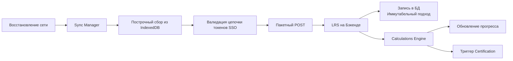
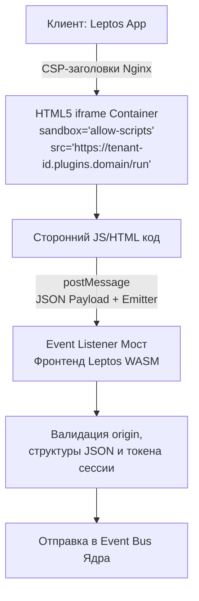
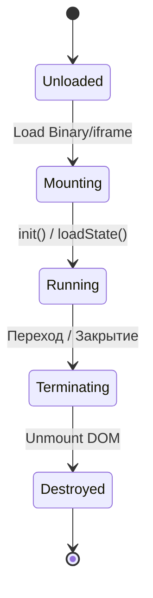
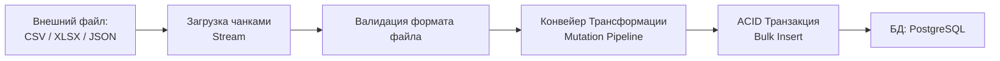

# Архитектура системы (Architecture Design Document)

> **Статус документа:** сводный обзорный документ (Architecture Design Document, ADD). Читается после [`SPECIFICATION.md`](SPECIFICATION.md) и до погружения в профильные спецификации.
>
> **Источники истины по разделам:**
> - Реляционная схема и RLS — [`DB_SCHEMA.md`](DB_SCHEMA.md)
> - Open API, токены, вебхуки — [`OPEN_API.md`](OPEN_API.md)
> - Рантайм плагинов (iframe / WASM) — [`PLUGIN.md`](PLUGIN.md)
> - Offline-First PWA и синхронизация — [`OFFLINE_SYNC.md`](OFFLINE_SYNC.md)
> - Стандарты (SCORM/xAPI/LTI/WCAG/GDPR) — [`STANDARDS.md`](STANDARDS.md)
>
> При расхождении между этим документом и профильным файлом — приоритет у профильного файла.

## РАЗДЕЛ 1: Слой данных и стратегия Strict Multi-tenancy

### 1.1. Стратегия разделения данных в СУБД (PostgreSQL)

Для обеспечения жесткой изоляции тенантов (Strict Multi-tenancy) при сохранении высокой экономической эффективности обслуживания системы выбирается архитектурный паттерн Shared Database, Shared Schema with Row-Level Security (RLS).

1. **Единая база данных и общие таблицы:** Все организации (тенанты) используют одну и ту же физическую базу данных PostgreSQL и один набор таблиц.
2. **Сквозной идентификатор:** Каждая таблица, содержащая данные тенанта (пользователи, курсы, батчи, тесты, сертификаты), обязана содержать неизменяемое поле `tenant_id UUID NOT NULL`.
3. **Аппаратная изоляция через RLS:**
   * На уровне СУБД для всех таблиц тенантов активируется режим `ALTER TABLE ... ENABLE ROW LEVEL SECURITY;`.
   * Создаются глобальные политики (Security Policies), которые автоматически фильтруют любые SQL-запросы (`SELECT`, `UPDATE`, `DELETE`) по значению `tenant_id`, установленному в текущей сессии подключения бэкенда к СУБД.
   * Бэкенд на Rust (Axum) при обработке запроса извлекает идентификатор тенанта из SSO-контекста и перед выполнением бизнес-транзакции устанавливает переменную сессии в пуле соединений (см. [`CODING_STANDARDS.md`](CODING_STANDARDS.md) §2.1). Внешний запрос физически не способен считать строки чужого тенанта, даже если в коде бэкенда допущена логическая ошибка в `WHERE`.

### 1.2. Концептуальная схема Core-базы данных (Entities & Relations)

#### Сущность 1: tenants (Глобальная таблица)

* `id`: UUID (Primary Key)
* `domain_name`: VARCHAR (Кастомный домен, уникален, опционально)
* `sso_config`: JSONB (Настройки интеграции: OIDC Client ID, Secret, SAML Metadata, LDAP endpoints)
* `branding_config`: JSONB (Логотипы, конфигурация переменных Tailwind CSS)
* `status`: ENUM ('active', 'suspended', 'archived')
* `created_at` / `updated_at`: TIMESTAMP

#### Сущность 2: users (Изолированная таблица тенанта)

* `id`: UUID (Primary Key)
* `tenant_id`: UUID (Foreign Key -> tenants.id)
* `external_id`: VARCHAR (Уникальный ключ из внешней системы/SSO тенанта)
* `email`: VARCHAR
* `first_name` / `last_name`: VARCHAR
* `system_role`: ENUM ('admin', 'instructor', 'mentor', 'learner', 'observer')
* `metadata`: JSONB (Динамические поля, заполненные через Custom ETL Mapper)
* **Индексы:** Композитный уникальный индекс `(tenant_id, external_id)` и `(tenant_id, email)`.

#### Сущность 3: programs (Изолированная таблица тенанта)

* `id`: UUID (Primary Key)
* `tenant_id`: UUID (Foreign Key -> tenants.id)
* `title`: VARCHAR
* `description`: TEXT
* `settings`: JSONB (Логика выдачи сертификатов, правила прохождения)

#### Сущность 4: courses (Изолированная таблица тенанта)

* `id`: UUID (Primary Key)
* `tenant_id`: UUID (Foreign Key -> tenants.id)
* `program_id`: UUID (Foreign Key -> programs.id, NULLable)
* `title`: VARCHAR
* `structure`: JSONB (Блочное дерево юнитов, текстовых блоков и ссылок на плагины)

#### Сущность 5: batches (Группы совместного обучения)

* `id`: UUID (Primary Key)
* `tenant_id`: UUID (Foreign Key -> tenants.id)
* `course_id`: UUID (Foreign Key -> courses.id)
* `title`: VARCHAR (Название потока, например «Когорта 2026-А»)
* `schedule_config`: JSONB (Календарные дедлайны для юнитов, даты живых сессий)

#### Сущность 6: quizzes & assignments (Аттестация)

* `id`: UUID (Primary Key)
* `tenant_id`: UUID (Foreign Key -> tenants.id)
* `course_id`: UUID (Foreign Key -> courses.id)
* `unit_id`: VARCHAR (Идентификатор блока в структуре курса)
* `content_data`: JSONB (Для тестов: пул вопросов, типы ответов. Для заданий: описание практики, файлы, рубрикаторы оценки)

#### Сущность 7: certificates (Выданные достижения)

* `id`: UUID (Primary Key)
* `tenant_id`: UUID (Foreign Key -> tenants.id)
* `user_id`: UUID (Foreign Key -> users.id)
* `entity_type`: ENUM ('course', 'program', 'batch')
* `entity_id`: UUID (Идентификатор сущности, за которую выдан сертификат)
* `verification_code`: VARCHAR (Уникальный публичный хэш-код для проверки)
* `issued_at`: TIMESTAMP

---

## РАЗДЕЛ 2: Архитектура Open API и Менеджмент Токенов (API Keys)

### 2.1. Механизм авторизации внешних систем

Платформа использует два изолированных контура генерации и валидации ключей доступа.

1. **Контур Глобального API (Уровень платформы):**
   * Токены выпускаются только супер-администратором системы.
   * Тип: Ограниченные по времени асимметричные JWT (подписанные приватным ключом ядра).
   * Доступные эндпоинты: `POST /api/v1/internal/tenants` (создание нового тенанта).
2. **Контур Локального API (Уровень конкретного Тенанта):**
   * Администратор тенанта генерирует ключи в интерфейсе личного кабинета.
   * Тип: Opaque Tokens (Непрозрачные токены). Представляют собой криптографически стойкую строку случайных байт с префиксом (например, `nx_live_...`).
   * Хранение: В базе данных ядра (таблица `tenant_api_keys`) сохраняется исключительно хэш токена по алгоритму SHA-256, дата создания, дата истечения (TTL) и массив разрешенных областей видимости (Scopes). Оригинальный токен показывается пользователю ровно один раз.
   * Валидация: При входящем запросе бэкенд хэширует строку из заголовка `Authorization: Bearer <token>`, делает точечную выборку из БД, проверяет TTL и извлекает жестко привязанный `tenant_id`.

### 2.2. Архитектура Глобального Эндпоинта Динамического Создания Тенантов

* **Запрос:** `POST /api/v1/internal/tenants`
* **Доступ:** Строго по Глобальному API-ключу супер-администратора.
* **Принимаемая структура данных (Payload):**
  * Наименование организации.
  * Настройки первичного SSO (Тип провайдера, Issuer URL, Client ID).
  * Параметры кастомизации (Первичные цвета UI).
  * Корневые данные учетной записи администратора тенанта (ФИО, Email, Внешний ID).
* **Фоновый конвейер обработки (Pipeline):**
  1. Валидация уникальности доменного имени/идентификатора тенанта.
  2. Открытие ACID-транзакции в PostgreSQL.
  3. Создание записи в таблице `tenants` с генерацией нового `tenant_id`.
  4. Инициализация системных настроек и дефолтных профилей маппинга для новой организации.
  5. Создание записи в таблице `users` для корневого администратора тенанта.
  6. Генерация и возврат первичного административного API-токена уровня тенанта для дальнейшей автоматической синхронизации.

---

## РАЗДЕЛ 3: Архитектура LRS, модель данных xAPI и стратегия синхронизации Offline-First

Этот раздел регламентирует сбор учебной аналитики (цифрового следа), структуру хранилища LRS, клиентское кэширование внутри PWA и отказоустойчивую синхронизацию при восстановлении сети.

### 3.1. Архитектура хранилища LRS (Сравнительный анализ и инвариантные схемы)

Хранилище записей учебного опыта (Learning Record Store — LRS) оперирует иммутабельными (неизменяемыми) данными высокой интенсивности записи, соответствующими международной спецификации xAPI (IEEE 2900.1 / Experience API). Каждая запись представляет собой Statement (выражение) в формате JSON-LD.

На этапе написания ТЗ бэкенд на Rust проектируется инвариантно под две целевые СУБД.

#### Вариант А: TimescaleDB (Расширение PostgreSQL)

* **Архитектура:** Таблица `xapi_statements` преобразуется в гипертаблицу (Hypertable), автоматически секционированную по времени (`timestamp`).
* **Схема данных:** `tenant_id` (UUID), `statement_id` (UUID), `timestamp` (TIMESTAMPTZ), `stored_at` (TIMESTAMPTZ), `statement_json` (JSONB).
* **Оптимизация:** Активируется нативная сегментация и сжатие по колонкам (Compression Policy) для записей старше 7 дней. Переиспользуется существующий пул соединений ядра.

#### Вариант Б: Выделенный кластер ClickHouse

* **Архитектура:** Бэкенд на Rust использует асинхронный клиент (`clickhouse-rs`) для пакетной записи (Buffer Engine).
* **Схема данных:** Таблица с движком `MergeTree` (без дедупликации — иммутабельный подход, см. [`OFFLINE_SYNC.md`](OFFLINE_SYNC.md) §5).
* **Ключ сортировки (ORDER BY):** `(tenant_id, timestamp, course_id, user_id)`.
* **Поля:** `tenant_id` (UUID), `statement_id` (UUID), `user_id` (UUID), `course_id` (UUID), `timestamp` (DateTime64), `stored_at` (DateTime64), `verb` (LowCardinality(String)), `payload` (String / JSON).

### 3.2. Базовая модель данных xAPI Statement (Спецификация JSON)

Каждое действие, совершенное студентом (в интерфейсе ядра, тесте, задании или внутри WASM-плагина), сериализуется в валидный xAPI JSON-объект. Общий крейт Rust (`shared`) содержит строгие структуры для обеспечения сквозной типобезопасности.

#### Основные компоненты структуры Statement

1. **Actor (Субъект):** Идентификатор студента. Содержит корпоративный email или уникальный `external_id` внутри конкретного тенанта.
2. **Verb (Глагол):** Действие. Используются строго типизированные URI из международного реестра (ADL Vocabulary):
   * `http://adlnet.gov` — запуск юнита/плагина.
   * `http://adlnet.gov` — успешное завершение курса/юнита.
   * `http://adlnet.gov` — ответ на вопрос в тесте (Quiz).
   * `https://w3id.org` — шаг или интерактивное действие внутри предметного плагина.
3. **Object (Объект):** Цель действия. Содержит URI элемента курса, идентификатор программы (Program), модуля (Unit), теста (Quiz) или конкретного интерактивного WASM-модуля.
4. **Result (Результат):** Опциональный блок для тестов и заданий. Передает параметры `score` (текущий балл, минимальный, максимальный), `success` (boolean-статус прохождения) и `duration` (время выполнения в формате ISO 8601).
5. **Context (Контекст):** Обязательное поле для обеспечения мультитенантности. В блоке `extensions` фиксируется `tenant_id`, а в блоке `contextActivities` — связь с текущим потоком обучения (Batch ID).

### 3.3. Клиентская Offline-Очередь (IndexedDB в PWA)

Progressive Web App (PWA) на базе Rust Leptos инициализирует Service Worker, контролирующий состояние сети (`navigator.onLine`). При переходе клиента в офлайн-режим рантайм переключается на изоляционную логику работы.

#### Механика накопления цифрового следа в офлайне

1. **Инициализация хранилища:** Внутри браузера создается защищенная база данных IndexedDB с двумя основными хранилищами (Object Stores):
   * `offline_xapi_statements` — для логов цифрового следа.
   * `offline_plugin_state` — для сохранения снимков состояния интерактивных модулей (`saveState()`).
2. **Транзакционная запись:** При прохождении тестов, чтении текстов или действиях в верифицированных WASM-плагинах, Leptos-приложение генерирует xAPI Statement, присваивает ему уникальный локальный `statement_id` (UUID v4) и записывает в `offline_xapi_statements`.
3. **Временные метки:** Поле `timestamp` заполняется точным временем совершения действия по системным часам клиентского устройства. Поле `stored_at` (время сохранения на сервере) остается пустым до момента синхронизации.

### 3.4. Транзакционный Менеджер Синхронизации (Sync Manager)

Менеджер синхронизации — это изолированный фоновый процесс внутри PWA, активирующийся по событию восстановления сети (`online`) или по триггеру Service Worker (Periodic Background Sync).

#### Алгоритм выполнения синхронизации

1. **Авторизационный контроль:** Пересылка данных блокируется до тех пор, пока клиентский слой SSO не подтвердит валидность текущей сессии пользователя (или не обновит OAuth2 Refresh-токен в фоновом режиме).
2. **Пакетная отправка (Bulk Upload):** Statements считываются из IndexedDB пачками (по 50–100 штук) и отправляются на бэкенд Axum через специализированный эндпоинт `POST /api/v1/analytics/lrs/sync`. Контракт эндпоинта фиксируется в [`OPEN_API.md`](OPEN_API.md).
3. **Иммутабельное разрешение конфликтов:**
   * Если студент выполнял один и тот же тест (Quiz) на двух разных офлайн-устройствах (например, на планшете и смартфоне), бэкенд полностью отказывается от стратегии перезаписи данных (Last Write Wins).
   * Оба пакета данных принимаются системой как абсолютно валидные исторические факты.
   * В базу данных LRS (TimescaleDB / ClickHouse) записываются все конфликтующие или пересекающиеся во времени statements. Каждому присваивается серверное время получения `stored_at`.
4. **Калькуляция итогов (Post-Processing):** После успешной записи пакета бэкенд ядра инициирует событие в Event Bus. Служба подсчета успеваемости (Calculations Engine) анализирует всю цепочку statements для данного `user_id` и `course_id`, пересчитывает агрегированный прогресс по правилам, заданным тенантом (например, «Учитывать лучшую попытку из всех зафиксированных в LRS» или «Учитывать попытку с самой ранней временной меткой»), и при необходимости генерирует триггер для модуля Certification.
5. **Очистка локального кэша:** Только после получения от сервера ответа `200 OK` с подтверждением записи конкретных `statement_id`, данные пачки атомарно удаляются из IndexedDB устройства.

---

## РАЗДЕЛ 4: Гибридный Рантайм Плагинов (Plugin SDK & Execution Runtime)

Этот раздел регламентирует техническую реализацию расширяемости платформы. Он определяет методы изоляции, протоколы взаимодействия и жизненный цикл микроприложений (плагинов) как в режиме песочницы (iframe), так и в нативном WebAssembly-контуре фронтенда.

### 4.1. Спецификация Plugin SDK: Унифицированный интерфейс взаимодействия

Независимо от способа доставки и запуска (JS/iframe или Rust/WASM), каждое микроприложение взаимодействует с Ядром через стандартизированный слой абстракции — Plugin SDK.

Контракт взаимодействия на уровне типов данных (крейт `shared`) декларирует следующие ключевые методы:

* `init(context: PluginContext)` — Вызывается Ядром при монтировании плагина. Передает токен сессии, `user_id`, `tenant_id`, `course_id`, `unit_id`, а также текущие настройки кастомизации UI (цветовую палитру тенанта).
* `getContext() -> PluginContext` — Возвращает текущий рабочий контекст выполнения плагина.
* `saveState(state_json: String)` — Вызывается плагином для персистентного сохранения своего текущего состояния (например, прогресса прохождения интерактива, позиции элементов, логов сессии) в базу данных Ядра.
* `loadState() -> String` — Запрашивает у Ядра последнее сохраненное состояние для восстановления сессии пользователя.
* `sendEvent(event: RawPluginEvent)` — Отправляет сырое событие плагина в Event Bus Ядра для последующего маппинга в xAPI Statement.

### 4.2. Уровень А: Архитектура изоляции и взаимодействия для iframe-плагинов

Для сторонних, внешних или непроверенных модулей Ядро разворачивает изолированную среду исполнения, предотвращающую XSS-атаки и утечку данных между тенантами.

#### Механика контейнеризации и безопасности

1. **Разделение доменов (Origin Isolation):** iframe-плагины физически загружаются и исполняются на выделенном поддомене, изолированном от основного приложения тенанта (например, `https://<tenant-id>.plugins.domain`).
2. **Атрибуты песочницы (Sandbox Attributes):** Тег `<iframe>` рендерится Leptos-компонентом со строгим набором ограничений: `sandbox="allow-scripts"`. Отсутствие флага `allow-same-origin` принудительно заставляет браузер рассматривать документ внутри iframe как уникальный origin, полностью закрывая ему прямой доступ к `localStorage`, cookies, IndexedDB основного приложения и к родительскому DOM-дереву.
3. **Политики сетевой безопасности (CSP):** На уровне Nginx для домена плагинов отдаются заголовки Content-Security Policy (CSP), которые аппаратно запрещают плагину выполнять внешние сетевые запросы (`connect-src 'none'`), ограничивая его коммуникацию только с родительским окном.

#### Протокол взаимодействия (postMessage Bridge)

* Обмен данными между iframe и Ядром происходит асинхронно через `window.postMessage`.
* **Слой отправки:** Плагин вызывает `window.parent.postMessage(payload, targetOrigin)`. Структура payload строго типизирована: содержит идентификатор метода SDK, токен сессии и полезную нагрузку.
* **Слой приема:** Leptos-приложение на стороне Ядра регистрирует глобальный Event Listener. При получении события фронтенд валидирует origin отправителя, проверяет целостность структуры данных и сверяет токен сессии. Если валидация пройдена, сообщение перенаправляется во внутреннюю шину событий бэкенда.

### 4.3. Уровень Б: Динамический WASM-рантайм для верифицированных плагинов

Доверенные и верифицированные плагины компилируются под архитектуру `wasm32-unknown-unknown` и исполняются непосредственно внутри адресного пространства клиентской части платформы.

#### Динамическая загрузка модулей (Dynamic Streaming Compilation)

1. При переходе студента на юнит, содержащий верифицированный плагин, Leptos-фронтенд инициирует асинхронный HTTP-запрос к DAM-хранилищу для получения скомпилированного `.wasm` файла.
2. Используя браузерное API `WebAssembly.instantiateStreaming`, приложение на лету компилирует и монтирует бинарный модуль в среду выполнения без перезагрузки интерфейса.

#### Организация памяти и реактивного взаимодействия

* **Нулевая сериализация (Zero-Copy):** WASM-плагин и родительское приложение Leptos разделяют общий пул линейной памяти (`WebAssembly.Memory`). Передача контекста и вызовы методов SDK происходят через прямые указатели на области памяти (Pointer & Length offset) с использованием биндингов `wasm-bindgen`. Это исключает затраты процессора на JSON-сериализацию/десериализацию.
* **Реактивный рендеринг:** Плагин может быть спроектирован как нативный Leptos-компонент. Он встраивается непосредственно в Virtual DOM (или работает с DOM через интерфейсы `web-sys`), плавно адаптируясь под CSS-сетку Tailwind родительского шаблона.

#### Автономность в офлайне (Offline-First интеграция)

Поскольку верифицированный WASM-модуль работает в одном контексте безопасности с Ядром, он получает прямой доступ к локальным JavaScript-интерфейсам, проброшенным через Service Worker:

* Вызовы метода `saveState()` автоматически перенаправляются фронтендом в локальное хранилище IndexedDB тенанта.
* Сырые события плагина мгновенно пишутся в локальную xAPI-очередь в памяти браузера, обеспечивая 100% функциональность интерактивного блока при полном отсутствии сети.

### 4.4. Жизненный цикл плагина (Plugin Lifecycle Management)

Ядро жестко контролирует состояния микроприложений на всех этапах их выполнения с помощью конечного автомата (Finite State Machine):

1. **Unloaded (Не загружен):** Плагин существует в виде статического артефакта (`.wasm` файл или URL-ссылка) в DAM-хранилище тенанта.
2. **Mounting (Монтирование):** Ядро резервирует DOM-ноду, создает контейнер (iframe или WASM-контекст), инициализирует рантайм, считывает исторический state пользователя из БД/IndexedDB и вызывает метод `init()`, передавая данные сессии.
3. **Active / Running (Активен):** Плагин полностью интерактивен. Пользователь взаимодействует с ним, плагин генерирует события `sendEvent()` и периодически сбрасывает контрольные точки прогресса через `saveState()`.
4. **Terminating (Завершение работы):** Вызывается при переходе пользователя на другой юнит или закрытии PWA. Ядро отправляет плагину сигнал закрытия. Плагин обязан выполнить финальный асинхронный `saveState()`. Устанавливается жесткий тайм-аут (Graceful Shutdown Timeout) в 800 мс.
5. **Destroyed (Уничтожен):** Память WASM-модуля освобождается (Garbage Collection), либо iframe атомарно удаляется из DOM-дерева Leptos-приложения.

---

## РАЗДЕЛ 5: Архитектура обработки тяжелых фоновых задач и ETL-конвейера

Этот раздел регламентирует архитектуру подсистемы асинхронного выполнения тяжелых и ресурсоемких процессов. Основной упор сделан на обеспечение стабильности ядра при массовом импорте/экспорте пользователей тенанта, парсинге файлов через Custom ETL Mapper и расчете крупномасштабных цепочек сертификации.

### 5.1. Инвариантная архитектура очередей и распределения задач

Для предотвращения блокировки основного потока обработки входящих HTTP-запросов (API-эндпоинтов бэкенда на Rust Axum) система разделяется на два независимых слоя: API-сервер и Task Workers (Воркеры задач).

В соответствии с требованиями инвариантности, бэкенд проектируется с возможностью переключения между двумя архитектурными подходами на уровне конфигурации сборки (компиляции) и среды окружения.

#### Подход 1: Встроенный асинхронный рантайм (In-Memory Tokio Tasks)

* **Архитектура:** Задачи упаковываются в асинхронные футуры и передаются планировщику Tokio с помощью макроса `tokio::task::spawn` или через внутренние каналы связи `tokio::sync::mpsc`.
* **Управление ресурсами:** Платформа инициализирует ограниченный пул потоков (Thread Pool), выделяя под тяжелый импорт фиксированное количество воркеров (например, не более 25% от общего числа ядер CPU), защищая основные веб-потоки.
* **Жизненный цикл:** Очередь является эфемерной и хранится исключительно в оперативной памяти процесса. Для минимизации рисков потери задач при перезапуске бэкенда внедряется механизм Graceful Shutdown, ожидающий завершения активных Tokio-задач в течение заданного тайм-аута (до 30 секунд).

#### Подход 2: Внешняя персистентная очередь (River / Redis-backed Queue)

* **Архитектура:** Задачи сериализуются в JSON/MessagePack и помещаются в персистентное хранилище. В качестве брокера используется либо специализированная Rust-библиотека River, интегрированная непосредственно в таблицы PostgreSQL тенантов, либо распределенная инфраструктура на базе Redis/KeyDB.
* **Управление ресурсами:** Процессы Task Workers запускаются как изолированные ОС-демоны или отдельные Docker-контейнеры. Они могут горизонтально масштабироваться независимо от API-серверов.
* **Жизненный цикл:** Полная отказоустойчивость. Каждая фоновая задача снабжается уникальным UUID. Воркеры используют паттерн Acknowledgment (ACK): задача удаляется из очереди только после успешного выполнения и фиксации коммита в БД. В случае падения воркера задача автоматически возвращается в очередь по истечении тайм-аута видимости (Visibility Timeout).

### 5.2. Архитектура кастомного ETL-маппера импорта пользователей

Визуальный конструктор маппинга полей инициирует сложный конвейер обработки данных (Extract, Transform, Load), выполняемый асинхронным воркером.

#### 1. Extract (Извлечение и Потоковое чтение)

* API-сервер принимает файл (CSV, XLSX, JSON, XML) от администратора тенанта или через Open API, сохраняет его во временное защищенное DAM-хранилище (MinIO/S3) и генерирует задачу для воркера с указанием ссылки на файл и ID выбранного JSON-профиля маппинга (MappingProfile).
* Воркер считывает файл потоково, чанками (пакетами по 500–1000 строк), используя асинхронные Rust-парсеры. Это предотвращает переполнение операционной памяти (OOM) даже при обработке файлов на сотни тысяч записей.

#### 2. Transform (Конвейер Мутации и Валидация данных)

Каждая строка файла проходит через изолированный цепочечный конвейер трансформации (Data Mutation Pipeline):

* **Маппинг полей:** Строковые ключи из файла сопоставляются с внутренними полями сущностей системы на основе JSON-схемы профиля.
* **Нормализация (Regex & Маски):** Данные пропускаются через предопределенные Rust-компилятором регулярные выражения (например, очистка номеров телефонов от лишних символов, приведение email к нижнему регистру, валидация корректности формата дат).
* **Динамическое вычисление метаданных:** Дополнительные колонки файла (например, «Филиал», «Грейд», «Номер договора») упаковываются в иммутабельный JSONB-объект `metadata` для последующей записи в профиль пользователя.

#### 3. Load (Пакетная атомарная запись)

* Сформированный пакет валидированных пользователей отправляется в БД PostgreSQL. Вместо построчных запросов воркер использует механизм высокопроизводительной пакетной вставки (Bulk Insert / COPY via SQLx).
* Для каждого чанка открывается изолированная ACID-транзакция. Если в рамках пакета из 1000 пользователей происходит критическая ошибка структуры данных, транзакция текущего чанка откатывается (`ROLLBACK`), логируется в отчет об импорте, а воркер переходит к следующему чанку без прерывания общего процесса.

### 5.3. Обеспечение атомарности, мониторинга и стратегии повторов (Retry Policies)

Фоновые воркеры функционируют по строгим регламентам контроля ошибок:

* **Стратегия повторов (Retry Policy с экспоненциальной задержкой):** Если задача завершается ошибкой, вызванной внешними факторами (например, временная недоступность внешнего SSO-сервера при синхронизации или блокировка таблиц СУБД), система применяет алгоритм Exponential Backoff с джиттером. Задача откладывается и перезапускается через 2, 4, 8, 16 минут. Максимальное количество попыток по умолчанию равно 5.
* **Атомарность идемпотентности:** Каждая интеграционная задача от внешних систем через Open API обязана содержать уникальный заголовок `X-Idempotency-Key`. Перед запуском тяжелого импорта воркер проверяет наличие активного или успешно завершенного процесса с таким ключом в Redis/PostgreSQL, полностью исключая риск дублирования пользователей при случайном повторном вызове API.
* **Журналирование и статус-менеджмент:** В процессе выполнения задачи воркер с шагом в 5% обновляет атомарный счетчик прогресса в оперативной памяти/БД. Администратор тенанта в реальном времени через веб-сокеты или GraphQL-подписку Leptos-интерфейса видит прогресс-бар («Обработано 15000 из 30000 строк») и по завершении получает детальный JSON-лог с указанием строк, вызвавших ошибки валидации.