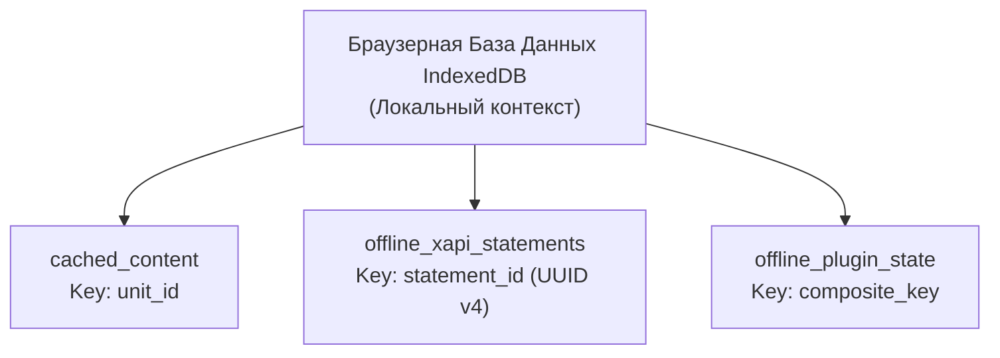

# Спецификация Технического Задания: Рантайм Офлайн-Режима и PWA

**Файл спецификации:** `OFFLINE_SYNC.md`

> Сводная картина — в [`ARCHITECTURE.md`](ARCHITECTURE.md) §3. Количественные лимиты (IndexedDB, размер пачки, медиа-кэш) — в [`NFR.md`](NFR.md). CSP и разрешения для видеоплеера — в [`DEPLOY.md`](DEPLOY.md) §2.

## 1. Регламент Офлайн-функциональности (Offline-First Boundaries)

В условиях полного или частичного отсутствия сетевого подключения образовательная платформа гарантирует непрерывность учебного процесса в рамках строго определенных архитектурных границ контента.

> **Граница применимости.** Офлайн-режим работает **только** в клиентском WASM-контуре Leptos (крейт `client`) с локальным хранилищем IndexedDB. SSR-страницы (публичный сайт, лендинги, страница верификации сертификата, форма входа) **не кэшируются для офлайна** и доступны исключительно при наличии сети. Переход на SSR-маршрут в офлайне приводит к стандартному offline-экрану браузера.

### 1.1. Допустимые офлайн-операции (Доступный контур)

Студент имеет право выполнять следующие действия локально на своем устройстве:

* Осуществлять навигацию по ранее закэшированной структуре Образовательных программ (Programs), Курсов (Courses) и Модулей (Units).
* Изучать текстовые материалы, просматривать статические графические схемы, диаграммы и изображения, сохраненные локально.
* Проходить тесты (Quizzes) с выполнением локальной валидации ответов (проверка типов вопросов, фиксация выбранных вариантов ответов, промежуточный подсчет времени попытки).
* Взаимодействовать с верифицированными WASM-модулями плагинов (Контур Б), имеющими прямой доступ к клиентскому хранилищу.
* Записывать xAPI statements и состояния плагинов в локальную очередь IndexedDB для последующей синхронизации.

### 1.2. Ограниченные офлайн-операции (Блокируемый контур)

До момента восстановления стабильного сетевого соединения интерфейс PWA аппаратно блокирует и переводит в статус ожидания (Pending Network):

* **Любые SSR-страницы** — публичный сайт, лендинги, страница верификации сертификата, форма входа. Они требуют серверного рендеринга и не кэшируются для офлайна.
* Отправку практических работ (Assignments), требующих физической загрузки бинарных файлов (документов, архивов, исходного кода) на сервер хоста.
* Отправку и получение сообщений в реальном времени внутри текстовых чатов и хаба коммуникаций.
* Запуск и инициализацию неверифицированных iframe-плагинов (Контур А), если их внешние ресурсы не были принудительно кэшированы браузером в рамках домена песочницы.
* Медиа-контент, для которого администратором тенанта не разрешено офлайн-кэширование (см. §3.1).

### 1.3. Ограничения платформы (Device & Browser Capabilities)

Гарантии офлайн-режима различаются в зависимости от операционной системы и браузера. Это не «деталь реализации», а часть контракта с пользователем.

| Платформа | IndexedDB | Background Sync | WASM-кэш | Общий офлайн-сценарий |
|:---|:---|:---|:---|:---|
| **Desktop (Chromium, Firefox)** | Полная квота (десятки ГБ) | Да | Полный | Полный: текст, тесты, WASM, медиа (по разрешению) |
| **Android (Chromium)** | Полная квота | Да | Полный | Полный: текст, тесты, WASM, медиа (по разрешению) |
| **iOS / iPadOS (Safari, WebKit)** | **Сильно ограничена**: очистка после 7 дней без обращения; удаление при нехватке места | **Нет** | Ограничен | **Ограниченный**: текст, тесты, WASM-модули в пределах лимита; медиа — только онлайн; синхронизация — только при активной вкладке |

**Стратегия для iOS:**

* PWA на iOS **не закрывает** сценарий «полного офлайна» (обучение в метро/самолёте без сети в течение нескольких дней).
* Для iOS-сегмента целевой сценарий — **нативное мобильное приложение**, приоритетное в [`ROADMAP.md`](ROADMAP.md) §«Мобильное приложение».
* До выхода нативного приложения iOS-пользователи получают ограниченный офлайн: текст, тесты, WASM-модули в пределах лимита из [`NFR.md`](NFR.md); медиа — только онлайн.
* Синхронизация на iOS выполняется только при активной вкладке; Periodic Background Sync не используется.

---

## 2. Структура Клиентского Хранилища (IndexedDB Схема)

Для обеспечения персистентности данных на устройстве пользователя при закрытии вкладки или перезагрузке ОС, Service Worker фронтенда на Rust Leptos инициализирует и администрирует базу данных IndexedDB, изолированную на уровне браузерного контекста текущего тенанта.

База данных оперирует тремя основными изолированными хранилищами объектов (Object Stores).

### 2.1. Хранилище объектов: cached_content

Предназначено для хранения статических и конфигурационных данных, необходимых для рендеринга структуры обучения.

* **Первичный ключ (KeyPath):** `unit_id` (Строка, UUID элемента).
* **Индексы:** `course_id` (Индекс для быстрой выборки всех модулей конкретного курса).
* **Структура данных (JSON):**
  * Текстовое и верстальное тело юнита (очищенный HTML/Markdown).
  * Массив пулов вопросов для Quizzes с указанием весов, но без указания правильных маркеров ответов (для защиты от компрометации локального кода).
  * Конфигурационные параметры дедлайнов и ограничений батча (Batch Timeline).
  * Бинарные скомпилированные `.wasm` артефакты верифицированных плагинов, закодированные в формат хранения.

### 2.2. Хранилище объектов: offline_xapi_statements

Служит локальным буфером для сбора и удержания цифрового следа учащегося до момента восстановления сети.

* **Первичный ключ (KeyPath):** `statement_id` (Строка, UUID v4, генерируется фронтенд-рантаймом в момент фиксации действия).
* **Индексы:** `timestamp` (Для упорядочивания при отправке).
* **Структура данных (JSON):** Соответствует международному стандарту xAPI Statement JSON-LD. Поле `timestamp` заполняется точным временем совершения действия по внутренним системным часам клиентского устройства. Поле `stored_at` инициализируется как пустое (`null`).
* **Лимиты:** максимальный размер хранилища и максимальное количество statements — согласно [`NFR.md`](NFR.md). При достижении лимита новые записи не принимаются; UI переходит в режим предупреждения и предлагает пользователю синхронизироваться.

### 2.3. Хранилище объектов: offline_plugin_state

Предназначено для удержания промежуточных снимков памяти микроприложений, передаваемых через Plugin SDK.

* **Первичный ключ (KeyPath):** `composite_key` (Строка вида `user_id:unit_id:plugin_id`).
* **Индексы:** `unit_id`.
* **Структура данных (JSON):** Неструктурированная JSON-строка, переданная плагином из метода `saveState()`. Перезаписывается локально при каждом новом вызове функции фиксации прогресса.

---

## 3. Политики Кэширования Медиа-контента (Media Caching Engine)

Для исключения рисков аварийного переполнения дискового пространства и квоты браузера тяжелым видео- и аудиоконтентом (особенно на мобильных устройствах), процесс кэширования медиаресурсов переводится под гибридный контроль.

### 3.1. Уровень административного запрета (DRM / Безопасность контента)

Если в свойствах курса на стороне Бэкенда Ядра для видеофайлов выставлен флаг `allow_offline = false`, Service Worker перехватывает все запросы к стриминговым манифестам и принудительно запрещает их сохранение в локальное хранилище кэша браузера (CacheStorage), разрешая воспроизведение только в режиме прямого потокового вещания при наличии стабильного онлайн-соединения.

Дополнительно к этому флагу:

* **Подписанные URL (Signed URLs).** Все медиа-ресурсы из DAM-хранилища отдаются клиенту только по подписанным URL:
  * подпись — HMAC-SHA256 от пути ресурса + `tenant_id` + `user_id` + `expires_at`;
  * TTL подписи — 5–15 минут (значение по умолчанию — 10 минут; конфигурируется на уровне тенанта);
  * привязка к `tenant_id` и `user_id` — использование подписанного URL другим пользователем или тенантом технически невозможно;
  * после истечения TTL клиент запрашивает новую подпись через Open API (`POST /api/v1/content/signed-url` — контракт будет зафиксирован в [`OPEN_API.md`](OPEN_API.md) при реализации);
  * прямой доступ к DAM без подписи запрещён на уровне Nginx / политики bucket.
* **DRM (опционально, для Enterprise-тенантов).** Для чувствительного видеоконтента поддерживается подключение DRM-провайдера (Widevine / FairPlay / PlayReady) на уровне тенанта. В этом случае:
  * воспроизведение возможно только через DRM-совместимый плеер;
  * офлайн-кэширование сегментов допускается только в DRM-защищённом виде (зашифрованные сегменты, ключи выдаются при активной сессии);
  * разрешения для плеера (media-src, blob:) фиксируются в [`DEPLOY.md`](DEPLOY.md) §2 (CSP).

### 3.2. Уровень пользовательского выбора (On-Demand Caching)

При отсутствии административных запретов PWA предоставляет учащемуся интерфейс управления локальной памятью:

* **Режим по умолчанию (Легковесный кэш):** Видео- и аудиоресурсы не скачиваются в офлайн-кэш автоматически. Студенту без сети доступен только текст, схемы, локальные тесты и WASM-модули плагинов. На месте видеоплеера отображается заглушка с информацией о необходимости предзагрузки.
* **Режим принудительного кэширования:** Пользователю доступна кнопка «Загрузить для работы офлайн» (на уровне конкретного Юнита или Курса в целом). При активации триггера Service Worker выполняет фоновый разбор манифеста (HLS/DASH), скачивает сегменты видеопотока в разрешении, выбранном пользователем в настройках PWA, и помещает их в CacheStorage.

При переходе в офлайн Service Worker осуществляет перехват сетевых запросов видеоплеера и прозрачно подменяет внешние URL-адреса сегментов локальными файловыми дескрипторами из CacheStorage.

---

## 4. Алгоритм Транзакционной Синхронизации (Sync Manager API)

Фоновый процесс Менеджера Синхронизации (Sync Manager) активируется немедленно при наступлении браузерного события `navigator.onLine`, либо принудительно при инициализации приложения, либо по сигналу операционной системы Periodic Background Sync (на платформах, где он поддерживается — см. §1.3).

### 4.1. Схема конвейера синхронизации

1. **Авторизационный контроль (SSO Check):** Перед началом выгрузки рантайм проверяет валидность текущего токена сессии. Если токен истек, менеджер синхронизации приостанавливает работу, а PWA переводит интерфейс в состояние ожидания авторизации, требуя от пользователя обновить сессию (или выполняет тихий фоновый запрос к OAuth2 Refresh-эндпоинту, если доступна сеть).
2. **Пакетное чтение (Chunked Reading):** Statements упорядочиваются по индексу `timestamp` и извлекаются из IndexedDB `offline_xapi_statements` пачками (чанками) фиксированного размера (по умолчанию — 50 записей; максимум — согласно [`NFR.md`](NFR.md)).
3. **Передача данных (Bulk Upload):** Сформированная пачка отправляется на бэкенд Axum через эндпоинт `POST /api/v1/analytics/lrs/sync` (см. [`OPEN_API.md`](OPEN_API.md) §3.4).
4. **Атомарное подтверждение (Two-Phase Commit на клиенте):** Очистка локальной IndexedDB производится строго после получения от сервера HTTP-ответа `200 OK`, содержащего массив успешно записанных `statement_id`. Если запрос завершается сетевой ошибкой или таймаутом, вся пачка остается в IndexedDB для повторной отправки при следующем цикле.

---

## 5. Регламент разрешения конфликтов времени выполнения (Conflict Resolution)

При синхронизации данных с нескольких устройств, работавших в автономном режиме параллельно, платформа руководствуется принципом Иммутабельности Исторических Фактов.

* **Отказ от деструктивных политик:** Категорически запрещено использование разрушающих стратегий разрешения конфликтов вида Last Write Wins (Последняя запись побеждает) или автоматического затирания старых сессий.
* **Регистрация всех фактов:** Бэкенд LRS принимает пакет данных, проверяет криптографическую подпись структуры, и записывает в аналитическое хранилище (TimescaleDB / ClickHouse) все пришедшие statements как независимые исторические события.
* **Разделение временных меток:**
  * В колонку/поле `timestamp` СУБД записывает исходное время совершения действия, переданное с клиентских часов устройства.
  * В колонку/поле `stored_at` СУБД записывает точное серверное время физического помещения записи в хранилище.
* **Асинхронный пост-процессинг успеваемости:** Калькуляция прогресса, оценка прохождения тестов (Quizzes) и проверка условий автоматической генерации достижений (Certificates) полностью выносятся из транзакционного цикла синхронизации. Специализированный фоновый движок Calculations Engine запускается асинхронно после закрытия транзакции импорта. Он анализирует всю итоговую хронологическую цепочку действий пользователя из LRS и вычисляет финальный статус по правилам, настроенным в тенанте организации (например, «Учитывать попытку с максимальным баллом» или «Учитывать только первую хронологическую попытку»).