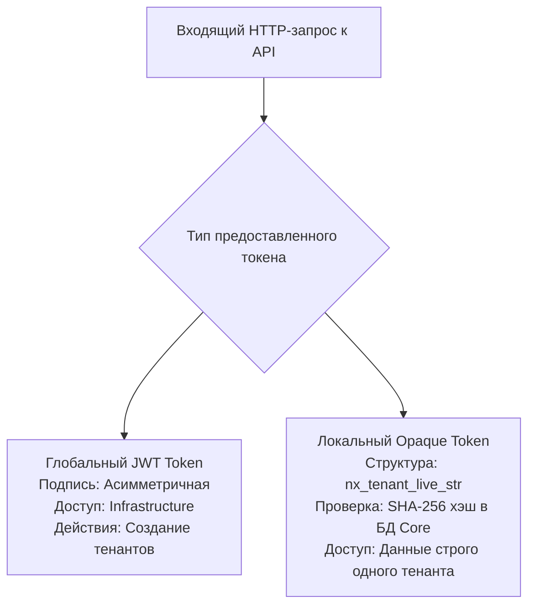

# Спецификация Технического Задания: Слой Интеграций и Открытого API

**Файл спецификации:** `OPEN_API.md`

> Сводная архитектурная картина — в [`ARCHITECTURE.md`](ARCHITECTURE.md) §2 и §3.4. Логика offline-синхронизации — в [`OFFLINE_SYNC.md`](OFFLINE_SYNC.md) §4. Полный перечень ролей и их scopes — в [`RBAC.md`](RBAC.md). Соответствие стандартам — в [`STANDARDS.md`](STANDARDS.md). Политика версионирования — в §5 этого файла. Управление криптоключами — в [`DEPLOY.md`](DEPLOY.md) §4.4. Лицензирование — в [`LICENSING.md`](LICENSING.md). Feature Flags — в [`FEATURE_FLAGS.md`](FEATURE_FLAGS.md).

## 1. Архитектурные регламенты и Безопасность API

* **Спецификация:** Полная декларация всех интерфейсов через стандарт OpenAPI 3.0 (Swagger). Схемы и эндпоинты генерируются автоматически бэкендом на Rust непосредственно из метаданных структур данных ядра (с использованием макросов библиотеки `utoipa`). SCIM 2.0-эндпоинты описываются отдельной схемой (см. RFC 7643 / 7644).
* **Протоколы:**
  * REST API (JSON-payloads) — применяется для внешних систем, выполнения административных задач, синхронизации данных и массового ETL-импорта.
  * GraphQL — применяется как инвариантный шлюз для высокопроизводительного, реактивного и компонентного обмена данными с фронтендом на Rust Leptos.
  * SCIM 2.0 (REST/JSON) — применяется для real-time provisioning пользователей и групп из внешних HRIS/HRM (см. §3.5).
* **Защита от перегрузок (Rate Limiting):** Ограничение частоты входящих запросов реализуется на уровне API-шлюза бэкенда по алгоритму Token Bucket. Лимиты изолированы для каждого тенанта и дифференцируются в зависимости от уровня API-ключа (глобальный или локальный). Отдельные лимиты выделяются для:
  * SCIM bulk-операций (§3.5);
  * выдачи подписанных URL (§3.6) — частые короткие запросы, отдельный bucket;
  * offline-синхронизации (§3.4) — burst-friendly, чтобы не блокировать возврат студентов из офлайна.
* **Версионирование:** все REST-эндпоинты, кроме SCIM, используют путь `/api/vN/…` (N — major-версия). Политика версионирования, объявления deprecation и сроки жизни версий — в §5.

---

## 2. Менеджмент Токенов (API Keys Interface)

Для аутентификации и авторизации внешних автоматизированных систем платформа предоставляет строгое разделение прав доступа на два независимых и изолированных контура.



### 2.1. Глобальные токены (Уровень Платформы / Infrastructure Key)

* **Выдача:** Генерируются супер-администратором исключительно в главной системной консоли управления платформы.
* **Тип:** Асимметрично подписанные токены JWT (алгоритм EdDSA / RS256). Публичный ключ зашит в рантайм шлюза API, приватный ключ хранится в защищенном хранилище секретов. JWT **не хранится** в БД — валидация криптографическая (см. [`ARCHITECTURE.md`](ARCHITECTURE.md) §2.1).
* **Область видимости (Scopes):** `infrastructure:provisioning` (доступ к созданию тенантов), `infrastructure:monitor` (сбор глобальных технических метрик).
* **Отзыв ключей:** см. [`DEPLOY.md`](DEPLOY.md) §4.5 (runbook компрометации JWT). Список отозванных `kid` — таблица `revoked_jwt_kids` ([`DB_SCHEMA.md`](DB_SCHEMA.md) §1.2).

### 2.2. Локальные токены (Уровень Тенанта / Tenant API Key)

* **Выдача:** Генерируются администратором конкретной организации внутри личного кабинета управления тенанта.
* **Тип:** Непрозрачные строки (Opaque Tokens) повышенной энтропии с уникальным префиксом текущего тенанта для оптимизации маршрутизации (например, `nx_t1_live_7a8f9c...`).
* **Хранение:** В базе данных ядра PostgreSQL (таблица `tenant_api_keys`) сохраняется исключительно хэш токена по криптографическому алгоритму SHA-256, дата создания, дата истечения (TTL) и массив разрешенных scopes. Оригинальный ключ демонстрируется в UI интерфейса ровно один раз при создании, после чего его восстановление технически невозможно.
* **Области видимости (Scopes):** Полный перечень scopes для каждой системной роли зафиксирован в [`RBAC.md`](RBAC.md) как источник истины. Токен несёт один или несколько scopes, соответствующих роли пользователя в тенанте:
  * **Контентные:** `content:read`, `courses:*`, `courses:write`, `quizzes:*`.
  * **Аналитические:** `analytics:read` (экспорт LRS, §3.3), `analytics:write` (пакетная синхронизация offline-очереди, §3.4).
  * **Пользователи и ETL:** `users:sync` (импорт пользователей, §3.2), `scim:sync` (SCIM provisioning, §3.5).
  * **Аттестация:** `assignments:evaluate`.
  * **Сертификаты:** `certificates:read`, `certificates:verify`.
  * **Внутренние:** `license:read` (просмотр статуса лицензии), `features:write` (управление делегированными feature flags).

> Перечень в этом разделе — примеры групп scopes; при добавлении нового эндпоинта соответствующий scope должен быть зафиксирован в [`RBAC.md`](RBAC.md).

---

## 3. Спецификация ключевых API-эндпоинтов

### 3.1. POST /api/v1/internal/tenants (Динамический Provisioning)

* **Уровень доступа:** Глобальный токен супер-администратора (`infrastructure:provisioning`).
* **Назначение:** Мгновенное динамическое создание изолированного цифрового пространства для новой партнерской организации.
* **Входящий Payload (JSON):**
  * `name`: Строка (Официальное наименование организации).
  * `routing_slug`: Строка (Уникальное символьное имя для доменной или SSO маршрутизации).
  * `sso_type`: Строка (Тип первичной авторизации: `'OIDC'`, `'SAML2'`, `'LDAP'`).
  * `sso_endpoint`: Строка (URL-адрес внешнего Identity Provider организации).
  * `admin_profile`: Объект (Данные корневого администратора тенанта: `first_name`, `last_name`, `email`, `external_id`).
  * `default_locale`: Строка, BCP-47 (опционально). Язык тенанта по умолчанию; при отсутствии — `'en'`.
* **Поведение бэкенда на Rust:**
  1. Проверяет глобальную уникальность `routing_slug`.
  2. Открывает ACID-транзакцию в PostgreSQL.
  3. Создает запись в глобальной таблице `tenants`, генерируя новый `tenant_id`.
  4. Инициализирует системные роли и базовые настройки для новой организации.
  5. Регистрирует учетную запись администратора в изолированной таблице `users` с привязкой к созданному `tenant_id`.
  6. Закрывает транзакцию и генерирует первичный локальный API-ключ тенанта.
* **Исходящий ответ (JSON):** Статус `201 Created`, содержащий сгенерированный `tenant_id`, подтвержденный `routing_slug` и тело первичного локального API-токена организации.

### 3.2. POST /api/v1/users/import-custom (Интерфейс Custom ETL)

* **Уровень доступа:** Локальный токен тенанта с правами `users:sync`.
* **Назначение:** Передача внешнего файла с данными сотрудников организации для фонового парсинга, валидации и зачисления.
* **Входящий Payload (Multipart FormData / Base64 Stream):**
  * `profile_id`: UUID (Идентификатор предварительно настроенной JSON-схемы маппинга полей тенанта).
  * `file_format`: Строка (`'csv'`, `'xlsx'`, `'xml'`, `'json'`).
  * `file_stream`: Бинарный поток данных файла.
* **Поведение бэкенда на Rust:**
  1. Шлюз API извлекает из хэша токена `tenant_id` и неявно подставляет его в контекст выполнения запроса.
  2. Проверяется существование и доступность указанного `profile_id` в рамках текущего тенанта.
  3. Поток файла атомарно перенаправляется в DAM-хранилище (MinIO/S3).
  4. Формируется мета-задача с уникальным `job_id`, которая помещается в асинхронную очередь фоновых воркеров (Tokio-tasks или River/Redis).
* **Исходящий ответ (JSON):** Статус `202 Accepted`, содержащий `job_id` и эндпоинт для трекинга прогресса импорта.

### 3.3. GET /api/v1/analytics/lrs/statements (Экспорт данных LRS)

* **Уровень доступа:** Локальный токен тенанта с правами `analytics:read`.
* **Назначение:** Потоковая выгрузка сырого цифрового следа обучения для синхронизации с внешними BI-платформами и корпоративными хранилищами (Data Warehouse).
* **Параметры фильтрации (Query Params):** `course_id` (UUID), `batch_id` (UUID), `since_timestamp` (DateTime64).
* **Поведение бэкенда на Rust:**
  1. Слой RLS автоматически ограничивает выборку рамками текущего `tenant_id`, привязанного к токену.
  2. Бэкенд выполняет оптимизированный запрос к аналитической базе данных (TimescaleDB / ClickHouse).
  3. Активируется потоковый стриминг данных (Server-Sent Events или Chunked Transfer Encoding). Сервер отдает массив валидных xAPI Statements напрямую из курсора БД в сетевой сокет, минимизируя нагрузку на операционную память (RAM).
* **Исходящий ответ (Stream):** Поток объектов xAPI JSON-LD со статусом `200 OK`.

### 3.4. POST /api/v1/analytics/lrs/sync (Пакетная синхронизация offline-очереди PWA)

* **Уровень доступа:** Локальный токен тенанта с правами `analytics:write` (выдаётся PWA-клиенту в рамках активной SSO-сессии; см. [`OFFLINE_SYNC.md`](OFFLINE_SYNC.md) §4 и [`RBAC.md`](RBAC.md), роль «Обучающийся»).
* **Назначение:** Приём пакета xAPI statements, накопленных клиентом в офлайне (IndexedDB → `offline_xapi_statements`), и запись их в LRS с сохранением исходных временных меток. Иммутабельный подход: сохраняются **все** пришедшие statements, включая конфликтующие попытки с разных устройств (см. [`ARCHITECTURE.md`](ARCHITECTURE.md) §3.4 и ADR [`2026.09.28-0002.md`](decisions/2026.09.28-0002.md)).
* **Входящий Payload (JSON):**
  * `statements`: Массив объектов xAPI JSON-LD. Каждый объект содержит:
    * `statement_id`: UUID v4 (сгенерирован на клиенте; используется для идемпотентного подтверждения записи).
    * `timestamp`: DateTime64 (исходное время совершения действия на устройстве).
    * `payload`: Объект xAPI Statement (Actor, Verb, Object, Result, Context).
  * `client_metadata`: Объект (опционально). `device_id`, `app_version`, `session_id` — для диагностики и разбора конфликтов.
* **Ограничения:**
  * Максимальный размер пакета — 100 statements (значение по умолчанию; конфигурируется на уровне тенанта).
  * Максимальный размер тела запроса — согласно [`NFR.md`](NFR.md).
* **Поведение бэкенда на Rust:**
  1. Слой RLS (Вариант А) / обязательный фильтр `tenant_id` (Вариант Б) автоматически ограничивает контекст текущим `tenant_id`, привязанным к токену.
  2. **Идемпотентность по `statement_id`.** Механизм зависит от варианта LRS:
     * **Вариант А (TimescaleDB):** `INSERT ... ON CONFLICT (statement_id) DO NOTHING`. Первичный ключ `statement_id` (UNIQUE) отсекает дубли на уровне СУБД.
     * **Вариант Б (ClickHouse):** прикладная идемпотентность через batch-`SELECT` по массиву `statement_id` из пакета → фильтрация уже существующих → `INSERT` только новых. Детали — в [`DB_SCHEMA.md`](DB_SCHEMA.md) §2 Вариант Б «Идемпотентность записи в ClickHouse».
     * В обоих вариантах все `statement_id` из пакета (новые и уже существующие) возвращаются клиенту в массиве `accepted` — клиент очищает их из IndexedDB как подтверждённые.
  3. Все новые statements записываются в аналитическое хранилище одной ACID-транзакцией (Вариант А) или одним `INSERT` (Вариант Б). Каждому присваивается серверное время `stored_at`.
  4. После успешной фиксации бэкенд инициирует событие в Event Bus для Calculations Engine (асинхронный пересчёт прогресса, см. [`ARCHITECTURE.md`](ARCHITECTURE.md) §3.4).
* **Исходящий ответ (JSON):** Статус `200 OK`:
  * `accepted`: Массив `statement_id`, которые успешно записаны или были записаны ранее (идемпотентное подтверждение). Клиент удаляет их из IndexedDB (см. [`OFFLINE_SYNC.md`](OFFLINE_SYNC.md) §4.1).
  * `rejected`: Массив объектов `{ statement_id, reason }` — statements, отклонённые по структурным ошибкам (валидация xAPI JSON-LD).
  * `server_time`: DateTime64 (серверное время ответа; используется клиентом для коррекции часов при следующем цикле синхронизации).

### 3.5. SCIM 2.0 Endpoints (`/scim/v2/Users`, `/scim/v2/Groups`)

Реализация RFC 7643 (Core Schema) и RFC 7644 (Protocol). Применяется для real-time provisioning пользователей и групп из внешних HRIS/HRM-систем (Workday, SAP SuccessFactors, 1C:ЗУП). См. [`STANDARDS.md`](STANDARDS.md) §«SCIM 2.0».

* **Уровень доступа:** Локальный токен тенанта с правами `scim:sync` (выдаётся администратору тенанта при настройке SCIM-интеграции; см. [`RBAC.md`](RBAC.md) §«Примечания»).
* **Базовый путь:** `/scim/v2` (совместим с существующей схемой маршрутизации; альтернативно — `/<tenant_slug>/scim/v2` при мультидоменной поставке).
* **Аутентификация:** `Authorization: Bearer <tenant_api_key>` со scope `scim:sync`. OAuth 2.0 Bearer Token (RFC 6750) — поддерживается как надстройка при интеграции с IdP, использующим SCIM.

#### 3.5.1. `GET /scim/v2/Users`

* **Назначение:** Пагинированный список пользователей тенанта. Поддерживаются фильтры (RFC 7644 §3.4.2.2): `userName eq`, `externalId eq`, `active eq`, `meta.lastModified gt`.
* **Параметры:** `startIndex`, `count`, `filter`, `sortBy`, `sortOrder`, `attributes`, `excludedAttributes`.
* **Ответ:** SCIM `ListResponse` с `totalResults`, `startIndex`, `itemsPerPage`, `Resources[]`. Поля пользователя маппятся из `users` (см. [`DB_SCHEMA.md`](DB_SCHEMA.md) §1.2): `userName` → `email`, `externalId` → `external_id`, `name.givenName` / `name.familyName` → `first_name` / `last_name`, `active` → вычисляется из `status` тенанта и статуса enrollment.

#### 3.5.2. `POST /scim/v2/Users`

* **Назначение:** Создание пользователя (provisioning).
* **Входящий Payload:** SCIM `User` (RFC 7643 §4.1).
* **Поведение:** Создаётся запись в `users` с `tenant_id` из токена. `system_role` по умолчанию — `'learner'`; повышение роли — отдельным вызовом (вне SCIM-скоупа, через административный API). При конфликте `userName` (email) в рамках тенанта — `409 Conflict` (SCIM `uniqueness`).
* **Ответ:** `201 Created` с полным SCIM `User`.

#### 3.5.3. `PATCH /scim/v2/Users/{id}`

* **Назначение:** Частичное обновление (SCIM `PatchOp`, RFC 7644 §3.5.2).
* **Поддержка:** `add`, `replace`, `remove` для `name`, `emails`, `active`, `externalId`.
* **Особый случай — `active = false`:** запускает offboarding (см. [`STANDARDS.md`](STANDARDS.md) §«SCIM 2.0»): пользователь исключается из активных `batches` (статус `dropped` в `batch_enrollments`), дальнейшие сессии блокируются, xAPI-логи сохраняются до срока retention.
* **Ответ:** `200 OK` с обновлённым SCIM `User` или `204 No Content` (в зависимости от реализации).

#### 3.5.4. `DELETE /scim/v2/Users/{id}`

* **Назначение:** Деактивация пользователя. Физическое удаление не выполняется — пользователь помечается как `active = false` (soft delete), запускается offboarding. Полное удаление — только через GDPR-эндпоинт (см. [`STANDARDS.md`](STANDARDS.md) §«Соответствие GDPR / CCPA»).
* **Ответ:** `204 No Content`.

#### 3.5.5. `GET / POST / PATCH / DELETE /scim/v2/Groups`

* **Назначение:** Синхронизация оргструктуры (групп) тенанта. Группы маппятся на `batches` (организационные потоки обучения).
* **Особенности:** членство в группе (`members[]`) управляет `batch_enrollments`; изменения обрабатываются идемпотентно.
* **Ограничения:** вложенные группы (sub-groups) не поддерживаются в базовом скоупе; плоская структура.

#### 3.5.6. Ограничения и поведение

* **Идемпотентность:** все `POST`-запросы SCIM обязаны содержать заголовок `X-Idempotency-Key` (аналогично §3.2 и [`ARCHITECTURE.md`](ARCHITECTURE.md) §5.3). Повторный вызов с тем же ключом возвращает результат первой операции.
* **Лимиты:** отдельный Rate Limit для SCIM-эндпоинтов (bulk-операции со стороны HRIS могут быть частыми); лимиты — в [`NFR.md`](NFR.md).
* **Логирование:** все SCIM-операции пишутся в `audit_log` с полями `%tenant_id`, `%user_id`, `%operation`, `%source = 'scim'` (см. [`DIAGNOSTICS.md`](DIAGNOSTICS.md) §1).
* **Вебхуки:** изменения через SCIM инициируют событие `user.scim.sync` (см. §4.1) для внешних подписчиков тенанта.
* **Версионирование:** SCIM 2.0 использует собственный путь `/scim/v2/…` в соответствии с RFC 7644; общая политика версионирования (§5) на него не распространяется.

### 3.6. POST /api/v1/content/signed-url (Выдача подписанного URL для медиа)

* **Уровень доступа:** Локальный токен тенанта с правами `content:read` (или PWA-токен активной SSO-сессии).
* **Назначение:** Выдача подписанного URL для доступа к медиа-ресурсу из DAM-хранилища. Прямой доступ к DAM без подписи запрещён (см. [`OFFLINE_SYNC.md`](OFFLINE_SYNC.md) §3.1).
* **Входящий Payload (JSON):**
  * `resource_id`: UUID (Идентификатор ресурса в DAM).
  * `resource_type`: Строка (`'video'`, `'audio'`, `'image'`, `'document'`).
  * `purpose`: Строка, опционально (`'stream'`, `'download'`, `'offline_cache'`). Значение `'offline_cache'` допускается только если `allow_offline = true` в свойствах курса.
* **Поведение бэкенда на Rust:**
  1. Слой RLS проверяет, что ресурс принадлежит текущему `tenant_id`.
  2. Проверяется, что пользователь имеет право доступа к ресурсу (зачислен на курс, юнит которого содержит ресурс).
  3. Вычисляется подпись HMAC-SHA256 от пути ресурса + `tenant_id` + `user_id` + `expires_at`.
  4. Возвращается подписанный URL с TTL 5–15 минут (по умолчанию 10 минут; конфигурируется на уровне тенанта).
* **Исходящий ответ (JSON):** Статус `200 OK`:
  * `signed_url`: Строка (URL с подписью и `expires_at` в query string).
  * `expires_at`: DateTime64 (момент истечения подписи).
  * `drm`: Объект или `null`. Если тенант настроил DRM (Widevine/FairPlay/PlayReady), содержит тип DRM, license URL и параметры, необходимые плееру.
* **Ошибки:**
  * `403 Forbidden` — ресурс принадлежит другому тенанту или пользователь не имеет доступа.
  * `409 Conflict` — запрошен `purpose = 'offline_cache'`, но `allow_offline = false`.

---

## 4. Конвейер Событийных Вебхуков (Webhooks Engine)

Платформа обязана в режиме реального времени (асинхронно) уведомлять внешние интегрированные HRM, CRM и ERP-системы тенанта о ключевых триггерах и изменениях состояний процесса обучения.

### 4.1. Регламент подписки и типы системных событий

Администраторы тенанта регистрируют в панели управления URL-адрес своего принимающего сервера (Webhook Endpoint) и подписывают его на определенные типы событий.

#### Бизнес-события

* `user.authenticated` — успешный вход пользователя через SSO (передача метаданных сессии).
* `user.scim.sync` — изменение пользователя или группы через SCIM (см. §3.5). Полезная нагрузка: `operation` (`create` / `update` / `delete`), `user_id`, `external_id`, `source = 'scim'`.
* `batch.created` — запуск нового потока совместного обучения.
* `batch.content_version.pinned` — момент фиксации версии контента для когорты (см. [`DB_SCHEMA.md`](DB_SCHEMA.md) §1.2, `batches.content_version`).
* `quiz.completed` — завершение студентом автоматизированного теста (передача итогового балла и xAPI-ссылки).
* `program.completed` — успешное закрытие студентом всех курсов программы обучения.
* `certificate.issued` — генерация цифрового сертификата (передача проверочного хэша и ссылки на верификацию).
* `retention.applied` — применение политики retention к классу данных тенанта (см. [`STANDARDS.md`](STANDARDS.md) §«Политики удержания данных»).

#### События безопасности и платформы

* `security.jwt_key_rotated` — ротация или отзыв ключа подписи JWT (см. [`DEPLOY.md`](DEPLOY.md) §4.5). Полезная нагрузка:
  * `kid`: идентификатор ключа (новый или отозванный);
  * `reason`: `'compromised'` | `'rotated'` | `'end_of_life'`;
  * `revoked_at`: TIMESTAMPTZ (если применимо);
  * `new_kid`: идентификатор нового ключа (если ротация успешна).
* `plugin.revoked` — отзыв WASM-плагина Контура Б через Revocation List. Полезная нагрузка:
  * `plugin_id`: строковый идентификатор;
  * `version`: версия плагина (если отзыв версионный);
  * `reason`: `'compromised'` | `'admin_action'` | `'cve_<CVE-ID>'`;
  * `cve_id`: идентификатор CVE (для `reason = 'cve_<CVE-ID>'`);
  * `severity`: `'low'` | `'medium'` | `'high'` | `'critical'` (для CVE);
  * `revoked_at`: TIMESTAMPTZ.

  Источники: ADR [`2026.09.29-0003.md`](decisions/2026.09.29-0003.md) (подпись и kill switch), ADR [`2026.09.29-0010.md`](decisions/2026.09.29-0010.md) (Supply Chain Security, отзыв по CVE).

#### События лицензирования

* `license.status_changed` — общее событие о смене статуса лицензии (см. [`LICENSING.md`](LICENSING.md) §6, поле `status`). Полезная нагрузка:
  * `license_id`: UUID;
  * `previous_status`: `'active'` | `'grace'` | `'expired'` | `'hard_limited'` | `'invalid'`;
  * `new_status`: то же;
  * `changed_at`: TIMESTAMPTZ.
* `license.grace_started` — переход лицензии в grace period (см. [`LICENSING.md`](LICENSING.md) §10). Полезная нагрузка:
  * `license_id`: UUID;
  * `expires_at`: TIMESTAMPTZ (дата истечения лицензии);
  * `grace_period_days`: INTEGER;
  * `days_remaining`: INTEGER (сколько дней до завершения grace period).

#### События версионирования API

* `api.deprecation.announced` — объявление о deprecation версии API (см. §5). Полезная нагрузка:
  * `api_version`: строка (`'v1'`, `'v2'`);
  * `sunset_date`: HTTP-date;
  * `migration_guide_url`: строка.

### 4.2. Безопасность и Верификация сообщений (Signing)

Для защиты принимающей стороны от атак повторения (Replay Attacks) и подделки данных (Spoofing), Webhooks Engine подписывает каждый исходящий запрос:

1. При регистрации вебхука тенанту генерируется уникальный секретный ключ (Webhook Secret).
2. Перед отправкой воркер вычисляет криптографическую сигнатуру тела запроса по алгоритму HMAC-SHA256, используя Webhook Secret.
3. Сигнатура и текущая временная метка сервера (Timestamp) помещаются в специализированные заголовки запроса: `X-Rust-LMS-Signature` и `X-Rust-LMS-Timestamp`. Принимающая внешняя система обязана самостоятельно пересчитать хэш и отклонить запрос при несовпадении сигнатур или при разнице во времени более 5 минут.

### 4.3. Регламент гарантированной доставки (At-least-once Delivery)

Webhooks Engine функционирует на базе асинхронных воркеров и гарантирует доставку уведомления минимум один раз:

* Успешной доставкой признается ответ внешнего сервера с HTTP-статусами 2xx (период ожидания ответа — жесткий таймаут 5 секунд).
* Если внешний сервер отвечает кодами ошибок 5xx, 429, или запрос обрывается по таймауту, воркер вебхуков переводит задачу в статус повтора.
* **Политика повторных попыток (Retry Policy):** Применяется алгоритм экспоненциального отката со случайным джиттером (Exponential Backoff with Jitter). Повторные запросы инициируются через 1, 5, 15, 60 и 180 минут с момента первой неудачи.
* Если после 5 последовательных попыток сервер интеграции не ответил успешно, отправка данного события прекращается, задача маркируется как `dead_letter` и помещается в административный лог системных ошибок конкретного тенанта для ручного аудита.

---

## 5. Политика версионирования и вывода из эксплуатации (Versioning & Deprecation Policy)

### 5.1. Схема версионирования

* **Major-версия** — в пути URL: `/api/v1/…`, `/api/v2/…`. Изменение major-версии означает breaking change.
* **Minor-изменения** — без изменения пути. Реализуются добавлением новых полей в ответ, новых опциональных query-параметров, новых эндпоинтов. Обратная совместимость сохраняется.
* **SCIM 2.0** — использует собственный путь `/scim/v2/…` согласно RFC 7644; политика этого раздела на него не распространяется.
* **GraphQL** — версионирование через отдельные поля и директиву `@deprecated`; major-версия GraphQL-схемы не выделяется в URL.

### 5.2. Что считается breaking change

Breaking change (требует новой major-версии):

* Удаление или переименование существующего поля в ответе.
* Изменение типа существующего поля (например, `string` → `integer`).
* Изменение семантики существующего поля (например, смена часового пояса в `timestamp`).
* Удаление или переименование эндпоинта.
* Изменение обязательности существующего поля (опциональное → обязательное).
* Изменение кодов ответа для существующих сценариев (например, `200` → `204`).
* Изменение требований к аутентификации или scope.

Не считается breaking change (можно в minor):

* Добавление нового поля в ответ.
* Добавление нового опционального query-параметра.
* Добавление нового эндпоинта.
* Добавление нового значения в перечисление (enum) **только если** клиент устойчив к unknown-значениям; если нет — считается breaking change для этого конкретного поля.
* Добавление нового типа вебхук-события (подписчик должен игнорировать неизвестные события).

### 5.3. Сроки жизни версий

* **Минимальный срок поддержки** — 12 месяцев с момента объявления deprecation.
* **Enterprise-тенанты** — срок поддержки может быть продлён по договору (индивидуально).
* **Air-gapped On-Premise** — политика deprecation фиксируется в контракте поставки; платформа не может принудительно «удалить» версию на изолированном контуре заказчика.

### 5.4. Объявление deprecation (RFC 8594)

При объявлении deprecation версии платформа использует стандартные HTTP-заголовки (RFC 8594) во всех ответах этой версии:

* `Deprecation: @<unix_timestamp>` — дата объявления deprecation.
* `Sunset: <HTTP-date>` — дата отключения версии.
* `Link: <migration-guide-url>; rel="deprecation"; type="text/html"` — ссылка на гайд по миграции.

Пример:

```http
HTTP/1.1 200 OK
Deprecation: @1759218604
Sunset: Wed, 30 Sep 2026 23:59:59 GMT
Link: <https://docs.example.com/migration/v1-to-v2>; rel="deprecation"; type="text/html"
```

### 5.5. Что происходит с токенами при переходе на новую версию

Токены **версионно-агностичны**: `tenant_api_keys` привязан к `tenant_id` и scopes, а не к версии API. При выпуске `/api/v2/…` существующие токены продолжают работать без изменений. Версия — свойство эндпоинта, не токена.

Исключение: если новая major-версия вводит **новые scopes** (например, `analytics:write:v2`), администратор тенанта обязан явно выдать их ключу. Существующие scopes не отзываются автоматически.

### 5.6. Уведомление интеграторов

При объявлении deprecation:

1. **Вебхук `api.deprecation.announced`** — отправляется всем подписчикам тенанта, у которых зарегистрирован вебхук на это событие.
2. **Письмо администратору тенанта** — на email владельца организации.
3. **In-app уведомление** — в `cpanel` для администраторов тенанта.
4. **Запись в [`CHANGELOG.md`](../CHANGELOG.md)** — с указанием версии, даты sunset и ссылки на гайд.

Интеграторы, не отреагировавшие на deprecation, продолжают получать заголовки `Deprecation` / `Sunset` в каждом ответе — это даёт им возможность обнаружить проблему автоматически до отключения версии.

### 5.7. График вывода из эксплуатации

* **T+0:** объявление deprecation. Версия помечается как deprecated. Заголовки RFC 8594 включаются.
* **T+6 месяцев:** повторное уведомление (вебхук + письмо). Опубликован финальный гайд по миграции.
* **T+12 месяцев:** `Sunset`. Версия отключается. Все запросы к ней возвращают `410 Gone` с телом, содержащим ссылку на актуальную версию.
* **T+12 месяцев + 30 дней:** версия удаляется из кодовой базы (после проверки, что в проде нет активных вызовов; для SaaS — по метрикам; для On-Premise — по отдельному решению заказчика).