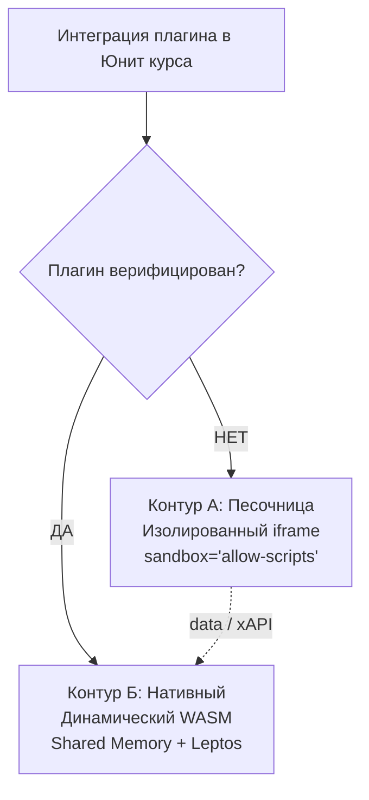
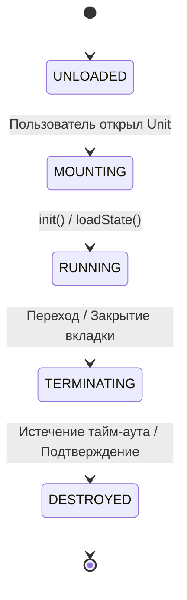

# Спецификация Технического Задания: Подсистема Микроприложений (Plugins)

**Файл спецификации:** `specs/PLUGIN.md`

> Сводная картина — в [`ARCHITECTURE.md`](ARCHITECTURE.md) §4. Общие требования к разработчикам плагинов — в [`PLUGIN_DEVELOPMENT_TEMPLATE.md`](PLUGIN_DEVELOPMENT_TEMPLATE.md). Инфраструктура подписи и хранения ключей — в [`DEPLOY.md`](DEPLOY.md). COOP/COEP-заголовки для SharedArrayBuffer — в [`DEPLOY.md`](DEPLOY.md) §2.

## 1. Введение и назначение документа

Настоящий документ регламентирует функциональные, системные и архитектурные требования к разработке, изоляции, контейнеризации и жизненному циклу подключаемых модулей (микроприложений / плагинов) в рамках образовательной платформы.

Плагины представляют собой «умные», интерактивные блоки контента, которые разрабатываются независимо от Ядра системы, не имеют прямого доступа к базе данных Ядра и расширяют возможности учебного процесса в рамках конкретных Модулей (Units) внутри Курсов (Courses).

Ядро системы выступает в роли инвариантного хост-рантайма: оно не содержит логики предметных областей, а лишь предоставляет микроприложениям контекст выполнения, стандартизированный UI-кит, шину событий и инструменты персистентности данных.

## 2. Архитектурные уровни рантайма (Execution Runtime)

Платформа в обязательном порядке реализует и поддерживает два изолированных контура исполнения микроприложений. Выбор контура для каждого конкретного плагина определяется его статусом верификации в административной панели глобального супер-администратора Ядра.

### 2.1. Контур А: Неверифицированные плагины (Изолированный iframe)

Применяется по умолчанию для всех внешних, кастомных или проходящих первичное тестирование модулей, безопасность которых не подтверждена аудитом.

* **Контейнеризация:** Микроприложение рендерится внутри интерфейса Ядра (клиентское приложение на Rust Leptos) с помощью HTML-тега `<iframe>`.
* **Изоляция доменов (Origin Isolation):** URL-адрес источника плагина обязан располагаться на выделенном изолированном поддомене (например, `https://<tenant_id>.plugins.domain/run`). Категорически запрещено размещать или проксировать сторонние плагины на основном домене Ядра или основном домене конкретного тенанта.
* **Атрибуты безопасности браузера:** Тег `<iframe>` в обязательном порядке снабжается атрибутом `sandbox` со строгим ограничением разрешений: `sandbox="allow-scripts"`. Флаг `allow-same-origin` принудительно опускается. Это заставляет браузер рассматривать документ внутри iframe как уникальный origin (даже при совпадении доменов), полностью блокируя плагину прямой доступ к `localStorage`, cookies, IndexedDB основного приложения Ядра и к родительскому DOM-дереву.
* **Сетевые ограничения (Content Security Policy):** Прокси-сервер (Nginx) для домена плагинов обязан отдавать CSP-заголовки, принудительно блокирующие исходящие сетевые запросы плагина к любым внешним ресурсам (`connect-src 'none'`), за исключением адреса шины событий Ядра, если это явно разрешено профилем плагина.
* **Ограничение автономности:** В данном режиме плагин не имеет доступа к локальным хранилищам браузера Ядра. Работа в офлайн-режиме PWA для таких плагинов ограничена стандартными механизмами кэширования статического HTML/JS-контента самого iframe, если это поддерживает браузер пользователя.

### 2.2. Контур Б: Верифицированные плагины (Динамический WebAssembly)

Применяется для модулей собственной разработки, референсных Enterprise-модулей и расширений, прошедших полный ручной или автоматизированный аудит безопасности и подписанных цифровым ключом платформы (процесс подписи, верификации и отзыва — см. §7).

* **Контейнеризация:** Микроприложение компилируется в бинарный файл с целевой архитектурой `wasm32-unknown-unknown` и загружается динамически непосредственно в клиентский рантайм фронтенда.
* **Механика доставки:** При переходе учащегося к Юниту с верифицированным плагином, Leptos-приложение инициирует асинхронное скачивание `.wasm` артефакта из DAM-хранилища текущего тенанта, **проверяет подпись** (см. §7) и производит потоковую компиляцию в рантайме браузера.
* **Интеграция памяти и UI:** Модуль исполняется в едином адресном пространстве памяти клиентской части. Рендеринг интерфейса плагина происходит нативно внутри Virtual DOM родительского приложения Leptos. Стилизация плагина динамически наследует CSS-классы Tailwind текущего тенанта.
* **Offline-First:** Верифицированный WASM-модуль имеет сквозной доступ к JavaScript-мостам Ядра, что позволяет ему работать при отсутствии сети, сохраняя лог действий и снимки состояния в общую IndexedDB-очередь платформы. Степень автономности ограничена квотами браузерного хранилища (см. [`OFFLINE_SYNC.md`](OFFLINE_SYNC.md) §1.3, лимиты — в [`NFR.md`](NFR.md) §4).

> **О памяти и «zero-copy».** Истинный zero-copy обмен между JS-хостом и WASM-модулем в браузере возможен **только** через `SharedArrayBuffer`, который, в свою очередь, требует установки заголовков `Cross-Origin-Opener-Policy: same-origin` и `Cross-Origin-Embedder-Policy: require-corp` (см. [`DEPLOY.md`](DEPLOY.md) §2). Без этих заголовков используется **copy-minimized bindings** — передача через прямые указатели на `WebAssembly.Memory` без JSON-сериализации, но с одним копированием в JS-память. Формулировка «zero-copy» в документации применяется только к режиму с `SharedArrayBuffer`; в остальных случаях корректно говорить о «copy-minimized».

## 3. Спецификация универсального Plugin SDK

Каждое микроприложение обязано взаимодействовать с Ядром исключительно через стандартизированный слой абстракции — Plugin SDK. Платформа предоставляет две зеркальные реализации SDK: JavaScript-библиотеку (для iframe-песочниц) и Rust-библиотеку/crate (для нативных WASM-модулей).

Интерфейс SDK содержит пять фундаментальных функциональных контрактов (методов):

1. **`init(context: PluginContext)` (Входной триггер):**
   * **Описание:** Автоматически вызывается Ядром сразу после успешного монтирования контейнера плагина в DOM.
   * **Полезная нагрузка:** Передает плагину структуру `PluginContext` (идентификатор текущей сессии, анонимизированный ID пользователя, ID тенанта, ID программы, ID курса, ID юнита, а также JSON-объект параметров кастомизации UI организации: основные цвета, скругления, шрифты).
2. **`getContext() -> PluginContext` (Запрос состояния контура):**
   * **Описание:** Синхронный метод, возвращающий текущий рабочий контекст, переданный при инициализации.
3. **`saveState(state_json: String)` (Персистенция прогресса):**
   * **Описание:** Вызывается плагином для сохранения промежуточного состояния своей внутренней логики.
   * **Поведение системы:** Ядро принимает строку (JSON-дамп состояния) и записывает ее в транзакционную БД ядра (в онлайне) или в локальную базу IndexedDB текущего устройства (в офлайне). Платформа не валидирует внутреннюю структуру этой строки — за ее консистентность и версионирование отвечает сам плагин.
4. **`loadState() -> String` (Восстановление сессии):**
   * **Описание:** Запрашивает у Ядра строку последнего сохраненного состояния для конкретной связки Пользователь + Юнит + Плагин. Используется для возобновления работы с той же точки, где пользователь прервал обучение.
5. **`sendEvent(event: RawPluginEvent)` (Подача учебного следа):**
   * **Описание:** Вызывается плагином при совершении пользователем значимого микродействия внутри интерактива.
   * **Полезная нагрузка:** Передает сырое событие, содержащее уникальный строковый маркер действия и динамический набор параметров (JSON).

## 4. Протоколы и транспорт коммуникации (Шина событий)

### 4.1. Транспорт для iframe-плагинов: postMessage Мост

Коммуникация между изолированной iframe-песочницей и Leptos-приложением хоста осуществляется асинхронно через браузерный механизм сообщений.

* **Исходящий поток (Плагин -> Ядро):** Плагин вызывает отправку сообщения в родительское окно. Сообщение обязано содержать строгую структуру: имя метода SDK, токен сессии из контекста и полезную нагрузку. Target Origin при отправке должен быть жестко ограничен основным доменом текущего тенанта.
* **Фильтрация на стороне Ядра:** Глобальный слушатель событий Leptos-приложения перехватывает сообщение и выполняет трехэтапную валидацию:
  1. Проверка origin отправителя на соответствие разрешенному поддомену плагинов текущего тенанта.
  2. Проверка структуры и полей JSON-объекта на соответствие декларативным схемам SDK.
  3. Проверка валидности токена сессии.
* **Результат:** При провале любого этапа валидации сообщение атомарно отбрасывается, событие логируется в системе безопасности как потенциальная угроза. При успешной проверке данные направляются во внутреннюю шину событий бэкенда.

### 4.2. Транспорт для WASM-плагинов: Shared Memory & Биндинги

Поскольку верифицированный плагин работает внутри единого процесса фронтенда, использование сетевых или оконных мостов полностью исключается.

* **Обмен данными.** Возможны два режима, выбор зависит от наличия `SharedArrayBuffer`:
  * **True zero-copy (при включённом `SharedArrayBuffer` и COOP/COEP-заголовках):** Обмен данными происходит через прямые указатели на области разделяемой памяти WebAssembly. Сериализация в JSON на стороне клиента для передачи хосту исключена. Этот режим требует `Cross-Origin-Opener-Policy: same-origin` и `Cross-Origin-Embedder-Policy: require-corp` (см. [`DEPLOY.md`](DEPLOY.md) §2).
  * **Copy-minimized (без `SharedArrayBuffer`):** Передача контекста и вызовы методов SDK происходят через прямые указатели на линейную память WASM (`WebAssembly.Memory`) с использованием биндингов `wasm-bindgen`. JSON-сериализация исключена; допускается одно копирование между памятью WASM и JS. Это режим по умолчанию, если COOP/COEP-заголовки не установлены или несовместимы со сторонними ресурсами.
* **Связывание:** Вызовы методов SDK транслируются напрямую в вызовы соответствующих асинхронных функций Ядра через низкоуровневые биндинги (`wasm-bindgen`). Данные мгновенно попадают в реактивную систему событий фронтенда.

## 5. Модель событийного маппинга (Преобразование в xAPI Statement)

Сырые события, поступающие от плагинов через метод `sendEvent()`, не сохраняются в LRS в исходном виде, так как они специфичны для конкретного плагина. Платформа реализует Сервис Маппинга (Mapper Service) на стороне бэкенда ядра.

* **Механика трансформации:** Администратор тенанта при подключении плагина к курсу задает (или импортирует из манифеста разработчика плагина) декларативную таблицу соответствий.
* **Логика преобразования:** При получении `RawPluginEvent` бэкенд ядра на Rust:
  1. Идентифицирует тенант, пользователя и контекст батча (Batch ID).
  2. Находит правило маппинга для пришедшего строкового маркера действия плагина.
  3. Преобразует маркер в международный URI Глагола (Verb) спецификации xAPI.
  4. Формирует валидный, иммутабельный JSON-LD объект xAPI Statement, обогащая его контекстными данными (Actor, Object, Extensions, Timestamp, Result).
  5. Отправляет готовый Statement на постоянное хранение в слой LRS (TimescaleDB / ClickHouse).

## 6. Жизненный цикл и конечный автомат плагина (Plugin Lifecycle)

Ядро платформы управляет состоянием любого микроприложения на странице с помощью жестко регламентированного конечного автомата (FSM). Переход между состояниями инициируется действиями пользователя или системными триггерами Ядра хоста.

1. **Состояние UNLOADED (Не загружен):**
   * **Описание:** Плагин зарегистрирован в структуре текущего Юнита, но пользователь еще не перешел на данную страницу обучения. Артефакты плагина (скрипты или бинарные файлы) находятся в DAM-хранилище тенанта.
2. **Состояние MOUNTING (Монтирование):**
   * **Триггер:** Пользователь открывает шаг курса, содержащий плагин.
   * **Действия Ядра:** Отрисовывается контейнер (тег iframe или выделенная DOM-нода под WASM). Запускается рантайм. Ядро запрашивает из БД/IndexedDB исторический дамп прогресса. Вызывается метод SDK `init()`, плагину передаются контекст выполнения и сохраненное ранее состояние.
3. **Состояние RUNNING (Активен / Исполнение):**
   * **Описание:** Плагин полностью доступен для взаимодействия. Осуществляется непрерывный прием сырых событий `sendEvent()` и фиксация контрольных точек прогресса пользователя через метод `saveState()`.
4. **Состояние TERMINATING (Завершение работы):**
   * **Триггер:** Пользователь кликает на кнопку «Следующий юнит» в интерфейсе Ядра, переходит в другое меню или закрывает вкладку PWA.
   * **Действия Ядра:** Платформа посылает плагину императивный сигнал закрытия (через postMessage или WASM-сигнал). Плагин обязан немедленно приостановить интерактив, заблокировать свой интерфейс, собрать финальный снимок прогресса и вызвать метод SDK `saveState()`.
   * **Ограничение по времени (Graceful Shutdown Timeout):** На выполнение финального сохранения плагину выделяется жесткий тайм-аут в 800 миллисекунд. По истечении этого времени Ядро хоста принудительно прерывает процесс, независимо от того, успел ли плагин ответить и зафиксировать данные.
5. **Состояние DESTROYED (Уничтожен):**
   * **Описание:** Контейнер плагина полностью удаляется из DOM-дерева Leptos-приложения. Выделенная под iframe память очищается браузером; в случае WASM — рантайм Ядра принудительно освобождает занятые плагином секторы линейной памяти и вызывает сборщик мусора (Garbage Collection).

## 7. Верификация, подпись и отзыв плагинов (Контур Б)

Этот раздел регламентирует процесс подписи `.wasm`-артефактов, их верификации при загрузке в клиент и механизм экстренного отзыва (kill switch) для уже закэшированных плагинов.

### 7.1. Пайплайн подписи

* **Кто подписывает:** платформа. Ключ подписи (release-ключ) хранится исключительно на стороне инфраструктуры платформы; сторонние разработчики плагинов **не получают** доступ к нему.
* **Когда:** на этапе релиза плагина в Контур Б. Подпись формируется в CI-пайплайне платформы после прохождения ручного или автоматизированного аудита безопасности.
* **Алгоритм:** Ed25519 (`ed25519-dalek` в Rust, `WebCrypto Ed25519` в браузере). Хэш артефакта — SHA-256.
* **Хранение ключа:** release-ключ хранится в защищённом хранилище секретов (Vault / KMS). В Air-gapped поставке — в локальном Vault (см. [`DEPLOY.md`](DEPLOY.md) §4). Публичный ключ верификации вшивается в `crates/client` на этапе сборки.
* **Артефакт подписи:** `.wasm.sig` — отдельный файл рядом с `.wasm` в DAM-хранилище. Хранит подпись Ed25519 и метаданные (версия плагина, дата подписи, идентификатор релиза).

### 7.2. Верификация подписи при загрузке

При монтировании плагина Контура Б (`MOUNTING`, см. §6) клиент выполняет:

1. Асинхронное скачивание `.wasm` и `.wasm.sig` из DAM-хранилища.
2. Вычисление SHA-256 от бинарного тела `.wasm`.
3. Проверку подписи `Ed25519(pub_key, sha256(wasm))` через `WebCrypto`.
4. **При успехе:** потоковая компиляция через `WebAssembly.instantiateStreaming` и монтирование модуля.
5. **При провале:** плагин **не монтируется**; событие логируется в `audit_log` с полями `%tenant_id`, `%user_id`, `%plugin_id`, `%reason = 'signature_mismatch'`; в UI отображается сообщение об ошибке плагина.

Публичный ключ верификации — единый для всей платформы; при ротации ключа допускается двойной комплект (старый + новый) на переходный период.

### 7.3. Revocation list (kill switch)

Если подписанный плагин скомпрометирован или признан небезопасным после релиза, платформа отзывает его.

* **Механизм:** ядро ведёт **Revocation List** — список `plugin_id` (или конкретных версий), запуск которых запрещён. Список хранится на сервере и отдаётся клиенту:
  * при загрузке PWA (инициализация);
  * периодически при активной сессии (фоновый запрос каждые N минут; N — в [`NFR.md`](NFR.md));
  * перед монтированием плагина, если есть сеть.
* **Действие при отзыве:**
  1. Если плагин **закэширован** в Service Worker-кэше или `cached_content` (IndexedDB) и **отозван** — при следующем онлайне клиент:
     * удаляет артефакты плагина из кэша;
     * очищает `offline_plugin_state` по этому `plugin_id`;
     * при попытке запуска — блокирует монтирование и показывает сообщение «Плагин отозван администратором».
  2. Если плагин **отозван и сети нет** — клиент использует последнюю известную версию Revocation List. Если `plugin_id` в ней уже числится — блокировка срабатывает. Если версия списка устарела и `plugin_id` ещё не числится — плагин может запуститься. Это **осознанный риск**: политика «fail-closed» (запрет всего при отсутствии списка) не применяется, потому что платформа не может работать офлайн без доверия к локальному кэшу.
  3. **Дополнение:** для критичных случаев тенант может включить режим «strict revocation» — тогда при отсутствии свежего Revocation List (старше N часов) Контур Б вообще не монтируется. Режим опционален и настраивается на уровне тенанта.
* **Ручной отзыв:** администратор платформы (глобальный супер-администратор) добавляет `plugin_id` в Revocation List через админ-панель. Действие фиксируется в `audit_log` и, при наличии подписок, инициирует вебхук `plugin.revoked` (см. [`OPEN_API.md`](OPEN_API.md) §4.1).

### 7.4. Инвалидация Service Worker-кэша

Отзыв плагина Контура Б требует не только записи в Revocation List, но и **инвалидации кэша** на всех клиентах тенанта:

* Клиент при получении обновлённого Revocation List проверяет, какие `plugin_id` затронуты.
* Для затронутых плагинов Service Worker:
  * удаляет `.wasm` и `.wasm.sig` из CacheStorage;
  * удаляет связанные записи из `cached_content` (IndexedDB);
  * удаляет `offline_plugin_state` для затронутых `plugin_id`.
* При следующем монтировании клиент скачивает актуальный артефакт заново (если плагин снова разрешён) или блокирует запуск (если отозван).

### 7.5. Связь с ADR

Процесс подписи, верификации и отзыва плагинов Контура Б — архитектурное решение, требующее фиксации в ADR:

* ADR: [`2026.09.29-0003.md`](decisions/2026.09.29-0003.md) — «Подпись, верификация и kill switch для WASM-плагинов Контура Б» (статус: Предложено).
* ADR фиксирует: алгоритм (Ed25519), формат `.wasm.sig`, стратегию ротации ключа, формат Revocation List, политику fail-open vs fail-closed при отсутствии сети.

## 8. Ограничения и лимиты

* Максимальный размер `.wasm`-плагина Контура Б — согласно [`NFR.md`](NFR.md) §4.
* Graceful Shutdown Timeout (800 мс) — жёсткий предел; плагин обязан укладываться в него (см. §6, состояние `TERMINATING`).
* Вложенные группы/плагины (sub-plugins) в базовом скоупе не поддерживаются.
* Лимит количества плагинов на тенант — согласно [`NFR.md`](NFR.md) §4.