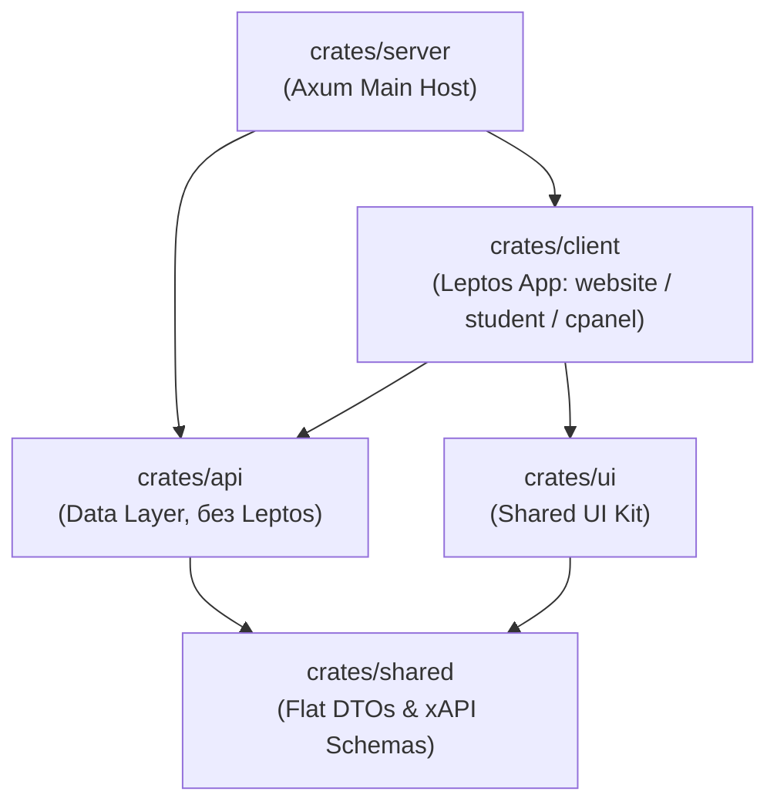

# Спецификация Технического Задания: Структура Проекта

**Файл спецификации:** `specs/STRUCTURE.md`

> Этот файл должен на 100% соответствовать реальному содержимому `crates/`. Любое создание/удаление/переименование файла внутри `crates/` обязано быть отражено здесь немедленно (см. [`AGENTS.md`](AGENTS.md) §4).

## 1. Концепция Workspace-архитектуры

Проект спроектирован по принципу микро-крейтов (micro-crates) в рамках монорепозитория (Cargo workspace). Каждая папка внутри `crates/` решает изолированную задачу рантайма, предотвращая циклическое связывание и утечку нативного серверного кода в клиентский WebAssembly-бандл.

Лимит размера крейта — ≤ 1500 строк бизнес-логики (без учёта тестов); см. [`AGENTS.md`](AGENTS.md) §6.

## 2. Глобальная иерархия каталогов репозитория

```text
.
├── Cargo.toml                    # Глобальный манифест Cargo workspace
├── CONTRIBUTING.md               # Стандарты коммитов и ветвления (root)
├── README.md                     # Главный путеводитель по репозиторию (root)
├── CHANGELOG.md                  # Журнал изменений (Conventional Commits)
│
├── specs/                        # Директория архитектурных спецификаций и ТЗ
│   ├── README.md                 # Разводящая страница документации
│   ├── AGENTS.md                 # Инструкции и чек-листы для AI-агентов
│   ├── CODING_STANDARDS.md       # Обязательные стандарты кодинга (full-stack Rust / RLS)
│   ├── STRUCTURE.md              # Настоящий файл: архитектурная карта папок
│   ├── SPECIFICATION.md          # Бизнес-концепция и требования к платформе
│   ├── ARCHITECTURE.md           # Сводный ADD: RLS, Open API, LRS, плагины, ETL
│   ├── NFR.md                    # SLA, RTO/RPO, latency, лимиты, Sizing Guide
│   ├── DB_SCHEMA.md              # PostgreSQL (RLS), версионирование, i18n, retention, LRS, feature flags, license
│   ├── MIGRATIONS.md             # Регламент миграций + Runbook для администратора
│   ├── OPEN_API.md               # REST/GraphQL, SCIM 2.0, signed-url, версионирование
│   ├── OFFLINE_SYNC.md           # Service Workers и IndexedDB для PWA, iOS-лимиты
│   ├── PLUGIN.md                 # Рантайм плагинов (iframe / WASM), FSM, подпись, kill switch
│   ├── PLUGIN_DEVELOPMENT_TEMPLATE.md # ТЗ для разработчиков внешних плагинов
│   ├── DEPLOY.md                 # Docker Compose, Nginx/CSP, Air-gapped, управление ключами, runbook JWT, Chaos
│   ├── LICENSING.md              # Офлайн-лицензирование для коробочных поставок
│   ├── FEATURE_FLAGS.md          # Управление функциональными флагами
│   ├── STANDARDS.md              # SCORM, xAPI, LTI, SCIM, WCAG, i18n, GDPR, Conformance Testing, Data Portability
│   ├── COMMUNICATIONS.md         # Чаты, комментарии, уведомления
│   ├── CONFERENCING.md           # ВКС: WebRTC P2P/SFU, локальные TURN/STUN
│   ├── ROADMAP.md                # Плановые направления
│   ├── STATUS.md                 # Матрица готовности фич (3 легенды)
│   ├── RBAC.md                   # Матрица ролей и доступов
│   ├── DIAGNOSTICS.md            # Логирование (tracing) и трейсинг (OpenTelemetry)
│   ├── GOTCHAS.md                # Журнал технических ловушек
│   ├── docker-compose.yml        # Манифест локального/On-Premise развёртывания
│   └── decisions/                # Реестр архитектурных решений (ADR)
│       ├── README.md             # Точка входа реестра ADR
│       ├── 2026.09.28-0001.md    # RLS вместо схем-per-tenant
│       ├── 2026.09.28-0002.md    # Иммутабельный xAPI в LRS
│       ├── 2026.09.29-0003.md    # Подпись и kill switch для WASM-плагинов
│       ├── 2026.09.29-0004.md    # Application-Level Encryption
│       ├── 2026.09.29-0005.md    # Data Residency: миграция тенанта
│       ├── 2026.09.29-0006.md    # Выбор OTel backend для SaaS
│       ├── 2026.09.29-0007.md    # Операционный регламент deprecation API
│       ├── 2026.09.29-0008.md    # Формат и enforcement лицензионного ключа
│       ├── 2026.09.29-0009.md    # Архитектура Feature Flags
│       └── 2026.09.29-0010.md    # Supply Chain Security для WASM-плагинов
│
└── crates/                       # Физические Rust-крейты платформы
    ├── shared/                   # Слой сетевых контрактов, структур сущностей и DTO
    ├── ui/                       # Общая библиотека Leptos UI компонентов и Tailwind CSS
    ├── api/                      # Ядро бизнес-логики, СУБД PostgreSQL (RLS) и LRS (без Leptos)
    ├── client/                   # Изоморфный Full-Stack веб-интерфейс, PWA и #[server] функции
    └── server/                   # Сервер выполнения на Axum (Точка входа, Main)
```

## 3. Детализация внутренней структуры крейтов

### 3.1. Крейт: `crates/shared` (DTO & Contracts)

Абсолютно плоский крейт без привязки к СУБД или UI. Содержит структуры данных, компилируемые как под `wasm32`, так и под нативный x86_64/arm64 сервер.

* `src/models/` — структуры сущностей (`User`, `Course`, `Program`, `Batch`, `Certificate`).
* `src/dto/` — запросы и ответы API-интерфейсов (`ImportPayload`, `SyncPackage`).
* `src/xapi/` — строгие иммутабельные типы для генерации xAPI Statements.

### 3.2. Крейт: `crates/ui` (Shared UI Library)

Изолированная дизайн-система платформы. Содержит переиспользуемые Leptos-компоненты хоста (формы, списки, кнопки, диалоги, тостеры уведомлений Fluent-локализации), не привязанные к конкретным роутам страниц. Должна компилироваться в WASM-контур.

Ответственность за соответствие WCAG 2.2 AA (см. [`STANDARDS.md`](STANDARDS.md) §«Доступность») лежит на этом крейте: семантика, ARIA, клавиатурный фокус, контрастность компонентов. Здесь же — поддержка RTL и локализация форматов (см. [`STANDARDS.md`](STANDARDS.md) §«Локализация»).

### 3.3. Крейт: `crates/api` (Business Logic & Data Layer)

Серверное бэкенд-ядро обработки данных. **Импорт макросов Leptos сюда аппаратно запрещен.**

* `src/database/` — менеджер пула соединений SQLx и RLS-интерцептор (`set_config('app.current_tenant_id', $1, true)`, см. [`CODING_STANDARDS.md`](CODING_STANDARDS.md) §2.1).
* `src/lrs/` — низкоуровневая обработка записей LRS (пакетный импорт в TimescaleDB или ClickHouse).
* `src/etl/` — потоковые чанк-парсеры кастомного импорта пользователей (Custom ETL Mapper).
* `src/scim/` — маппинг SCIM 2.0 (RFC 7643 / 7644) на внутренние сущности `users` / `batches` (см. [`OPEN_API.md`](OPEN_API.md) §3.5).
* `src/content/` — выдача подписанных URL для медиа, валидация прав доступа (см. [`OPEN_API.md`](OPEN_API.md) §3.6).
* `src/license/` — валидация лицензионного ключа, enforcement лимитов, чтение/запись таблицы `license` (см. [`LICENSING.md`](LICENSING.md)).
* `src/features/` — Feature Flags: чтение/запись `feature_flags` и `tenant_feature_flags`, in-memory кэш, LISTEN/NOTIFY-слушатель, API-контроллеры (см. [`FEATURE_FLAGS.md`](FEATURE_FLAGS.md)).
* `src/sbom/` — генерация SBOM (CycloneDX) для WASM-плагинов, сканирование уязвимостей через `osv-scanner`, интеграция с Revocation List (см. ADR [`2026.09.29-0010.md`](decisions/2026.09.29-0010.md)).

Миграции БД лежат в корневом каталоге `migrations/` (см. [`MIGRATIONS.md`](MIGRATIONS.md)) и не являются модулем внутри `api`.

### 3.4. Крейт: `crates/client` (Isomorphic Frontend & RPC)

Единое full-stack Leptos приложение сайта. Компилируется в PWA. Содержит сквозную сессию и роутинг, разделенный на внутренние функциональные контуры:

* `src/auth/` — сквозной SSO/RBAC слой аутентификации, валидация сессий и установка контекстов ролей.
* `src/website/` — публичные посадочные страницы, форма входа, публичный реестр верификации сертификатов.
* `src/student/` — личный кабинет учащегося, плеер прохождения юнитов курса, IndexedDB автономная очередь и рантайм Plugin SDK (потребительская сторона).
* `src/cpanel/` — Панель Управления (Control Panel) для Администраторов, Инструкторов и Менторов. Полностью компилируется в Lazy-Loaded WASM-модуль (ленивая загрузка, не раздувает бандл студента). Содержит административную сторону рантайма Plugin SDK (превью плагинов, валидация манифестов), раздел «Лицензия» (статус, потребление) и раздел «Feature Flags» (только делегированные флаги).
* `src/i18n/` — Fluent-локализация, переключение локали, RTL-логика (см. [`STANDARDS.md`](STANDARDS.md) §«Локализация»).
* `src/server.rs` — объявления `#[server]` RPC-функций приложения, транзакционно вызывающих методы `crates/api` на стороне сервера.

### 3.5. Крейт: `crates/server` (Axum Runtime Host)

Чисто серверное нативное приложение. Единственная точка входа, содержащая функцию `fn main()`.

* Считывает инфраструктурную конфигурацию `config.toml`.
* Инициализирует пулы подключений `SQLx` к PostgreSQL и ClickHouse/TimescaleDB.
* Монтирует Axum-роутер, связывает его с `#[server]` RPC-эндпоинтами крейта `client`, регистрирует REST-эндпоинты Open API ([`OPEN_API.md`](OPEN_API.md)) и запускает Tokio рантайм.
* Запускает cron-воркеры retention-политик (см. [`STANDARDS.md`](STANDARDS.md) §«Политики удержания данных») и воркеры вебхуков.
* Выполняет первичную валидацию лицензионного ключа при старте (см. [`LICENSING.md`](LICENSING.md) §4).
* Поднимает выделенное LISTEN-соединение для Feature Flags (см. [`FEATURE_FLAGS.md`](FEATURE_FLAGS.md) §8.3) и лицензии (`license_changed`).
* Периодический polling флагов (60 сек) и пересканирование SBOM активных плагинов (см. ADR [`2026.09.29-0010.md`](decisions/2026.09.29-0010.md) §3).

## 4. Направленность зависимостей и правила изоляции (Dependency Rules)



1. **Запрет обратного импорта:** Крейт `shared` не знает ничего о существовании верхних слоев. Крейт `api` никогда не зависит от Leptos-приложения `client`.
2. **Изоляция WASM-контура:** Крейты `ui` и `client` компилируются под таргет `wasm32-unknown-unknown` для работы в браузере. Им запрещено напрямую использовать нативные методы `crates/api` или `crates/server`. Вся связь между фронтенд-компонентами и бэкенд-логикой идет строго через объявления Leptos `#[server]` RPC-функций или асинхронные вызовы сетевого Open API.
3. **Идемпотентность типов:** Общие структуры в `shared` должны использовать примитивы, одинаково сериализуемые как макросами `serde` для сервера, так и `serde_wasm_bindgen` для клиента.